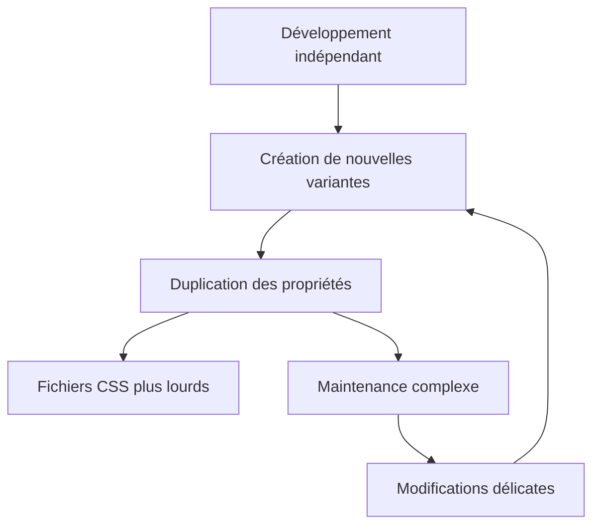

# 01-01-02 - Redondance et duplication des styles dans le CSS traditionnel

## Introduction

Dans le CSS traditionnel, la redondance et la duplication des styles sont des problèmes fréquents qui impactent la qualité, la performance et la maintenabilité du code. À mesure qu’un projet grandit, il devient courant de retrouver plusieurs règles très similaires, voire identiques, répétées à travers les feuilles de style. Cet article analyse ces phénomènes, leurs causes, leurs conséquences, puis propose des solutions pour les limiter.

---

## 1. Origines de la redondance et duplication des styles

### Multiplication des règles similaires

Dans une grande base de code, différents développeurs ou différentes parties du projet créent souvent des règles qui partagent des propriétés communes. Cela génère des styles quasi-duplication.

**Exemple :**

```css
/* Bouton primaire */
.button-primary {
  background-color: blue;
  color: white;
  padding: 10px 20px;
  border-radius: 5px;
}

/* Bouton secondaire, très proche */
.button-secondary {
  background-color: grey;
  color: white;
  padding: 10px 20px;
  border-radius: 5px;
}
```

Ici, `padding` et `border-radius` sont dupliqués inutilement.

### Absence de modularité et réutilisation

Sans conventions de nommage ou systèmes de composants clairs, chaque module ou page définit ses propres styles, souvent sans réutiliser les règles existantes.

---

## 2. Conséquences des styles redondants

### Augmentation du poids des fichiers CSS

Des règles en doublons gonflent inutilement les fichiers CSS, ralentissant leur chargement et augmentant la consommation réseau.

### Difficulté de maintenance

Modifier une propriété commune implique de rechercher toutes ses occurrences et de les mettre à jour, ce qui est source d’erreurs ou d’incohérences.

### Risque de conflits et incohérences visuelles

Les petites différences dans des styles dupliqués peuvent provoquer des apparences divergentes d’un composant censé être identique.

Diagramme Mermaid illustrant le cycle de la duplication et ses impacts :



---

## 3. Techniques pour limiter la duplication

### 3.1. Utilisation des préprocesseurs CSS (Sass, Less)

Grâce aux variables, mixins, fonctions, on peut centraliser les styles communs et éviter les répétitions.

**Exemple en Sass :**

```scss
$btn-padding: 10px 20px;
$btn-radius: 5px;

@mixin btn-style {
  padding: $btn-padding;
  border-radius: $btn-radius;
  color: white;
}

.button-primary {
  @include btn-style;
  background-color: blue;
}

.button-secondary {
  @include btn-style;
  background-color: grey;
}
```

### 3.2. Adoption d’une méthodologie de nommage et architecture CSS (BEM, ITCSS)

Ces méthodologies encouragent la pensée modulaire et la réutilisation explicite des styles.

### 3.3. CSS atomique / utility-first (ex. Tailwind CSS)

L’utilisation de classes utilitaires atomiques évite la duplication de propriétés dans des règles longues en favorisant la composition rapide.

**Exemple en Tailwind :**

```html
<button class="px-4 py-2 rounded text-white bg-blue-600">Primary</button>
<button class="px-4 py-2 rounded text-white bg-gray-600">Secondary</button>
```

Chaque classe représente une propriété CSS unique sans répétition dans la feuille.

### 3.4. Css Cascade Layers (`@layer`)

Introduit en CSS moderne, `@layer` permet de structurer les styles en niveaux avec un contrôle sur la priorité, limitant le besoin de surcharger les règles.

---

## 4. Conclusion

La redondance et duplication des styles sont des pièges courants du CSS traditionnel, rendant le code moins performant et difficile à gérer. Utiliser des outils préprocesseurs, adopter des architectures CSS modulaires, ou opter pour des approches utility-first sont autant de moyens efficaces pour contenir ces problèmes.

---

## Sources et références

- [Duplicate / Redundant CSS Styles (forum BricksBuilder)](https://forum.bricksbuilder.io/t/duplicate-duplicate-redundant-css-styles-external-files/31330)
- [Issue GitHub sur la redondance dans CSS Modules](https://github.com/css-modules/css-modules/issues/180)
- [Introduction to Atomic CSS with Examples - GeeksforGeeks](https://www.geeksforgeeks.org/css/introduction-to-atomic-css-with-examples/)
- [Pourquoi Tailwind CSS n'est pas redondant - Reddit Webdev](https://www.reddit.com/r/webdev/comments/1f2abca/anyone_else_find_tailwind_css_a_bit_too_redundant/)
- [Stack Overflow - Pourquoi des styles CSS dupliqués ?](https://stackoverflow.com/questions/11839441/what-is-the-purpose-of-having-duplicate-styles-in-css)

---

Ce contenu donne une connaissance claire et pratique des causes et solutions à la duplication en CSS, essentielle pour coder de manière efficace et durable.