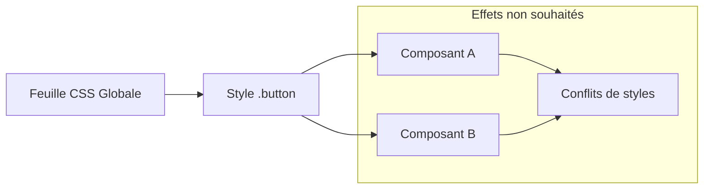

# 01-01-03 - Difficultés avec la modularité et la réutilisabilité dans le CSS traditionnel

## Introduction

Le CSS traditionnel, basé sur des feuilles de style globales, présente des limitations majeures en termes de modularité et de réutilisabilité. Ces contraintes compliquent la gestion des styles dans des projets modernes, où la séparation claire des composants et la réutilisation optimisée sont primordiales pour maintenir un code propre et évolutif. Cet article explore ces difficultés et présente des approches contemporaines pour y remédier.

---

## 1. Les causes des difficultés de modularité et réutilisabilité

### 1.1. Nature globale du CSS

Par défaut, les règles CSS s’appliquent globalement, ce qui signifie que tout sélecteur peut affecter n’importe quel élément du DOM. Cela crée :

- Des effets de bord non anticipés,
- Des conflits de style difficiles à diagnostiquer,
- Une faible isolation des composants.

**Exemple :**

```css
.button {
  background-color: blue;
  color: white;
}

.header .button {
  background-color: red;
}
```

Ici, la classe `.button` est définie globalement, et son style varie selon le contexte, ce qui nuit à la réutilisabilité simple.

### 1.2. Difficulté à créer des composants autonomes

En CSS traditionnel, il est compliqué d’écrire des styles strictement liés à un composant sans impacter l’extérieur puisque les sélecteurs et styles restent globaux.

---

## 2. Conséquences sur la maintenance et l'évolution du projet

- **Impossibilité d’isoler les bugs** : un changement dans une règle peut avoir des effets sur plusieurs composants,
- **Réutilisation limitée** : copier-coller de styles ou recours à des règles trop spécifiques pour adapter un style,
- **Croissance rapide de la complexité du CSS** due aux sélecteurs imbriqués et à la prolifération des classes.

Diagramme Mermaid illustrant la problématique de la modularité globale :



---

## 3. Solutions modernes pour améliorer modularité et réutilisabilité

### 3.1. CSS Modules

Technique qui scope automatiquement les classes CSS au niveau du composant, évitant la globalité des règles.

```jsx
// button.module.css
.button {
  background-color: blue;
  color: white;
}
```

```jsx
// Button.jsx
import styles from './button.module.css';

export default function Button(){
  return <button className={styles.button}>Click me</button>;
}
```

Cela limite le style uniquement à ce composant.

### 3.2. Méthodologies de nommage (BEM, ITCSS)

BEM (Block Element Modifier) organise les classes pour assurer une certaine modularité et lisibilité.

**Exemple BEM:**

```css
.block {}
.block__element {}
.block--modifier {}
```

Chaque composant est ainsi identifiable et isolé dans la nomenclature.

### 3.3. Frameworks utility-first (ex. Tailwind CSS)

En découpant les styles en classes atomiques, Tailwind permet la composition rapide sans écrire des styles globaux.

```html
<button class="bg-blue-600 text-white px-4 py-2 rounded">Button</button>
```

### 3.4. Composants web et Shadow DOM

Shadow DOM encapsule le style dans des composants web natifs, isolant complètement le CSS.

---

## 4. Architecture CSS modulaire et organisation du code

Adopter une structure modulaire dans les projets facilite la maintenance.

- **ITCSS** (Inverted Triangle CSS) classe les styles en plusieurs couches (base, layout, modules, skins, thèmes)
- Réduction des interdépendances entre modules

---

## 5. Conclusion

Le CSS traditionnel n’est pas conçu pour supporter facilement la modularité ni la réutilisabilité dans des projets complexes. Les approches modernes comme CSS Modules, BEM, Tailwind CSS, ou encore le Shadow DOM permettent d’isoler les styles et d’écrire un CSS plus maintenable, modulaire et extensible.

---

## Sources et références

- [CSS Modules Documentation](https://github.com/css-modules/css-modules)
- [BEM - Block Element Modifier Documentation](http://getbem.com/)
- [Tailwind CSS Documentation](https://tailwindcss.com/docs/utility-first)
- [ITCSS: Scalable and Maintainable CSS Architecture](https://www.xfive.co/blog/itcss-scalable-maintainable-css-architecture/)
- [Shadow DOM — MDN Web Docs](https://developer.mozilla.org/en-US/docs/Web/Web_Components/Using_shadow_DOM)
- [Why We Need Modular CSS - CSS-Tricks](https://css-tricks.com/modular-css/)

---

Ce contenu donne au lecteur une compréhension claire des limitations du CSS traditionnel sur la modularité et la réutilisabilité, ainsi qu’un panorama des solutions pratiques et actuelles.