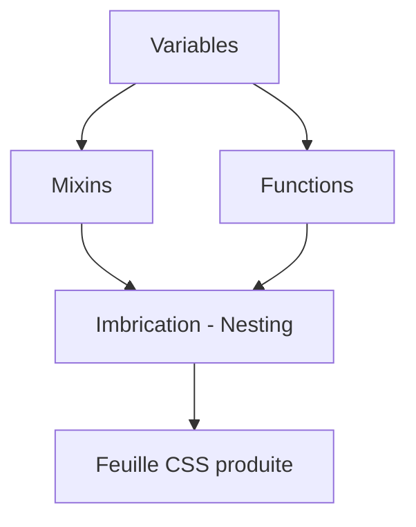

# 01-02-02 - Fonctionnalités principales de Sass : variables, nesting, mixins, fonctions

## Introduction

Sass (Syntactically Awesome Stylesheets) est un préprocesseur CSS qui ajoute des fonctionnalités puissantes et pratiques pour écrire du CSS plus efficace, modulaire, et maintenable. Ses quatre fonctionnalités principales — les variables, le nesting (imbrication), les mixins, et les fonctions — permettent de dépasser les limites du CSS traditionnel. Cet article détaille ces concepts avec des exemples concrets.

---

## 1. Variables

Les variables permettent de stocker des valeurs réutilisables comme des couleurs, dimensions ou polices, ce qui facilite la gestion et la modification des thèmes.

### Syntaxe

```scss
$primary-color: #3490dc;
$padding-base: 1rem;
```

### Utilisation

```scss
.button {
  background-color: $primary-color;
  padding: $padding-base;
}
```

Les variables améliorent la cohérence et permettent des modifications globales rapides.

---

## 2. Nesting (Imbrication)

Le nesting permet d’imprimer des sélecteurs imbriqués de manière logique et hiérarchique, ressemblant à la structure HTML, améliorant ainsi la lisibilité.

### Exemple

```scss
.nav {
  ul {
    margin: 0;
    padding: 0;
    list-style: none;
  }
  li {
    display: inline-block;
  }
  a {
    color: $primary-color;
    text-decoration: none;

    &:hover {
      text-decoration: underline;
    }
  }
}
```

**Ce code compile en CSS classique :**

```css
.nav ul {
  margin: 0;
  padding: 0;
  list-style: none;
}
.nav li {
  display: inline-block;
}
.nav a {
  color: #3490dc;
  text-decoration: none;
}
.nav a:hover {
  text-decoration: underline;
}
```

---

## 3. Mixins

Les mixins sont des blocs de code CSS réutilisables, acceptant souvent des paramètres. Ils évitent la duplication du style et simplifient la maintenance.

### Syntaxe et exemple

```scss
@mixin border-radius($radius) {
  border-radius: $radius;
  -webkit-border-radius: $radius;
  -moz-border-radius: $radius;
}

.box {
  @include border-radius(10px);
  background-color: $primary-color;
}
```

Les mixins peuvent accepté des arguments, ce qui rend leur usage très flexible.

---

## 4. Fonctions

Sass permet d’écrire ou d'utiliser des fonctions pour retourner des valeurs calculées, ce qui augmente la puissance du CSS.

### Exemple avec une fonction intégrée

```scss
$text-color: darken($primary-color, 10%);
```

Cette fonction `darken` assombrit la couleur `$primary-color` de 10%.

### Exemple de fonction personnalisée

```scss
@function calculate-rem($pixels) {
  @return #{$pixels / 16}rem;
}

.container {
  padding: calculate-rem(32);
}
```

Cela convertit une valeur pixel en rem, utile pour des mises en page responsives.

---

## 5. Diagramme Mermaid : Interaction des fonctionnalités principales



---

## 6. Conclusion

Les variables, le nesting, les mixins et les fonctions sont le cœur de Sass, apportant une modularité et une expressivité absentes du CSS traditionnel. Leur maîtrise permet d’écrire des feuilles de style plus courtes, plus claires et plus faciles à maintenir.

---

## Sources et références

- [Sass Official Documentation - Sass Basics](https://sass-lang.com/guide)
- [Sass: Variables, Nesting, Mixins and Functions - CSS-Tricks](https://css-tricks.com/sass-basics/)
- [MDN Web Docs - Sass](https://developer.mozilla.org/en-US/docs/Web/CSS/Sass)
- [Understanding SCSS Nesting - Scotch.io](https://scotch.io/tutorials/getting-started-with-scss-sass)
- [Sass Mixins and Functions - freeCodeCamp](https://www.freecodecamp.org/news/getting-started-with-sass-mixins-and-functions/)

---

Grâce à ces principes, Sass transforme l’écriture CSS en un processus plus structuré et efficace, offrant une base solide pour tout projet front-end moderne.