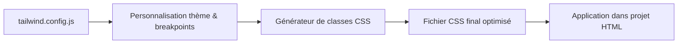

# 01-03-02 - Principales classes et configuration de Tailwind CSS

## Introduction

Tailwind CSS est un framework CSS utility-first offrant un ensemble exhaustif de classes utilitaires prêtes à l’emploi. Il permet de créer rapidement des interfaces personnalisées en combinant ces classes dans le HTML. Cet article présente les principales catégories de classes Tailwind, ainsi que la configuration via le fichier `tailwind.config.js` pour adapter Tailwind à vos besoins.

---

## 1. Principales catégories de classes Tailwind CSS

### 1.1. Classes d’espacement

- **Padding** : `p-{taille}`, `pt-{taille}`, `pr-{taille}`, `pb-{taille}`, `pl-{taille}`, `px-{taille}`, `py-{taille}`  
  Exemple : `p-4` correspond à `padding: 1rem;` (base 4 = 1rem).

- **Margin** : `m-{taille}`, `mt-{taille}`, `mr-{taille}`, `mb-{taille}`, `ml-{taille}`, `mx-{taille}`, `my-{taille}`  
  Exemple : `mt-2` pour `margin-top: 0.5rem;`.

### 1.2. Classes de typographie

- Taille de la police : `text-xs`, `text-sm`, `text-base`, `text-lg`, `text-xl`, etc.
- Couleur : `text-gray-700`, `text-red-500`,…
- Alignement : `text-center`, `text-left`, `text-right`.

### 1.3. Couleurs de fond et bordures

- Fond : `bg-blue-500`, `bg-green-200`, etc.
- Bordure : `border`, `border-2`, `border-red-600`, `border-dashed`.

### 1.4. Flexbox et grid

- Flex : `flex`, `flex-row`, `flex-col`, `justify-center`, `items-center`.
- Grid : `grid`, `grid-cols-3`, `gap-4`.

### 1.5. Etats interaction (pseudo-classes)

- Hover : `hover:bg-blue-700`.
- Focus : `focus:ring-2`.
- Active : `active:text-red-600`.

### 1.6. Autres

- Réactivité : les préfixes `sm:`, `md:`, `lg:`, `xl:`… appliquent une classe à partir d’une certaine largeur d’écran.
- Transitions, ombres, arrondis, etc.

---

## 2. Exemple d’utilisation combinée

```html
<div class="max-w-md mx-auto bg-white rounded-lg shadow-md p-6 hover:shadow-lg transition-shadow">
  <h2 class="text-2xl font-bold mb-4 text-gray-900">Titre principal</h2>
  <p class="text-gray-700 mb-6">Voici un paragraphe d'exemple avec Tailwind CSS.</p>
  <button class="bg-blue-500 hover:bg-blue-700 text-white font-semibold py-2 px-4 rounded">
    Cliquez-moi
  </button>
</div>
```

---

## 3. Configuration avec `tailwind.config.js`

Le fichier `tailwind.config.js` permet de personnaliser Tailwind :

### 3.1. Personnalisation des couleurs

```js
module.exports = {
  theme: {
    extend: {
      colors: {
        brand: {
          light: '#3fbaeb',
          DEFAULT: '#0fa9e6',
          dark: '#0c87b8',
        }
      }
    }
  }
}
```

Cette configuration ajoute la palette `brand` accessible via par exemple `bg-brand`, `text-brand-light`.

### 3.2. Gestion des breakpoints personnalisés

```js
module.exports = {
  theme: {
    screens: {
      'tablet': '640px',
      'laptop': '1024px',
      'desktop': '1280px',
    }
  }
}
```

Permet de définir les points de rupture réactifs personnalisés.

### 3.3. Ajout de nouvelles utilitaires via plugins

Tailwind accepte des plugins pour étendre ses fonctionnalités, ex: typographie, formulaires, animations.

---

## 4. Diagramme Mermaid illustrant le fonctionnement



---

## 5. Conclusion

Tailwind CSS repose sur une vaste palette de classes utilitaires couvrant presque tous les besoins CSS courants. La configuration via `tailwind.config.js` permet d’adapter facilement les styles au design spécifique d’un projet, tout en conservant la rapidité et la flexibilité du framework.

---

## Sources et références

- [Tailwind CSS Documentation - Utility Classes](https://tailwindcss.com/docs/utility-first)
- [Tailwind CSS Configuration](https://tailwindcss.com/docs/configuration)
- [Official Tailwind Plugins](https://tailwindcss.com/docs/plugins)
- [Tailwind CSS Responsive Design](https://tailwindcss.com/docs/responsive-design)
- [Tailwind CSS Guide on CSS-Tricks](https://css-tricks.com/intro-to-tailwind-css/)

---

Cet article donne un aperçu concret des classes clés de Tailwind CSS ainsi que de ses possibilités de configuration, offrant ainsi une base solide pour bâtir des interfaces efficaces et personnalisées.