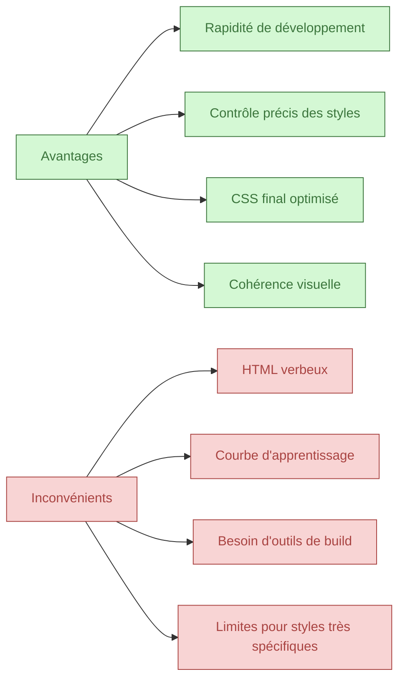

# 01-03-03 - Avantages et inconvénients de Tailwind CSS

## Introduction

Tailwind CSS est un framework CSS utility-first qui facilite la création d’interfaces UI rapidement et avec un contrôle fin. Cependant, comme tout outil, il présente à la fois des bénéfices et des limites. Cet article analyse les principaux avantages et inconvénients de Tailwind pour permettre une évaluation éclairée de son adoption.

---

## 1. Avantages de Tailwind CSS

### 1.1. Rapidité de prototypage et développement

Tailwind permet de construire des interfaces directement dans le HTML sans écrire une ligne de CSS personnalisée :

```html
<button class="bg-blue-600 hover:bg-blue-700 text-white font-bold py-2 px-4 rounded">
  Bouton
</button>
```

Pas besoin de créer des classes CSS, ce qui accélère la mise en place.

### 1.2. Contrôle granulaire et personnalisation

Chaque classe contrôle précisément une propriété CSS avec des valeurs prédéfinies – margin, padding, couleur, flexbox, etc. Cela évite les styles génériques des frameworks traditionnels.

### 1.3. Code CSS final optimisé

Grâce à la purge automatique (purgeCSS intégrée), Tailwind élimine toutes les classes inutilisées, réduisant la taille du fichier CSS produit.

### 1.4. Cohérence du design

Utiliser un jeu cohérent de classes utilitaires garantit une uniformité dans les espacements, couleurs, et typographies.

### 1.5. Facilité d’apprentissage dans certains contextes

Les développeurs front-end familiarisés avec CSS retrouvent rapidement les propriétés grâce aux noms explicites des classes.

---

## 2. Inconvénients de Tailwind CSS

### 2.1. HTML potentiellement verbeux et difficile à lire

L’utilisation intensive des classes utilitaires génère une multiplication de classes dans le même élément :

```html
<div class="bg-white p-6 rounded-lg shadow-md hover:shadow-lg transition-shadow">
  ...
</div>
```

Les balises HTML peuvent devenir longues et complexes à déchiffrer.

### 2.2. Courbe d’apprentissage

- Mémoriser toutes les classes peut prendre du temps.
- Le système de configuration et de variantes (responsive, états) demande une bonne compréhension.

### 2.3. Limites pour styles très personnalisés

Pour des designs très spécifiques, l’écriture manuelle de styles CSS complémentaires peut être nécessaire.

### 2.4. Nécessité d’une chaîne de build

Tailwind exige un environnement de compilation (Node.js, PostCSS) pour la génération optimisée, non adapté aux projets simples sans outil de build.

---

## 3. Exemple de comparaison de lisibilité

| CSS traditionnel                                | Tailwind CSS                                   |
|------------------------------------------------|-----------------------------------------------|
| `.btn { background-color: #3490dc; padding: 1rem; border-radius: 5px; color: white; }` | `<button class="bg-blue-600 p-4 rounded text-white">Bouton</button>` |

---

## 4. Diagramme Mermaid : Synthèse avantages vs inconvénients



---

## 5. Conclusion

Tailwind CSS propose une approche moderne centrée sur la rapidité et la qualité des interfaces UI via des classes utilitaires. Son adoption est particulièrement pertinente dans des projets dynamiques où la vitesse et la cohérence priment. Cependant, il nécessite un environnement techniquement adapté et suppose un investissement pour maîtriser son système. Le choix entre Tailwind et une approche CSS traditionnelle dépendra donc des besoins précis du projet et des compétences disponibles.

---

## Sources et références

- [Official Tailwind CSS - Pros and Cons](https://tailwindcss.com/docs/installation#pros-and-cons)
- [CSS-Tricks - Utility-First CSS Explained](https://css-tricks.com/utility-first-css/)
- [Smashing Magazine - What Are The Benefits Of Utility-First CSS Frameworks?](https://www.smashingmagazine.com/2021/03/benefits-utility-first-css-frameworks/)
- [LogRocket Blog - Pros and cons of Tailwind CSS](https://blog.logrocket.com/pros-cons-tailwind-css/)

---

Cet article synthétise clairement les forces et les faiblesses de Tailwind CSS pour orienter une décision éclairée et mise en œuvre adaptée.