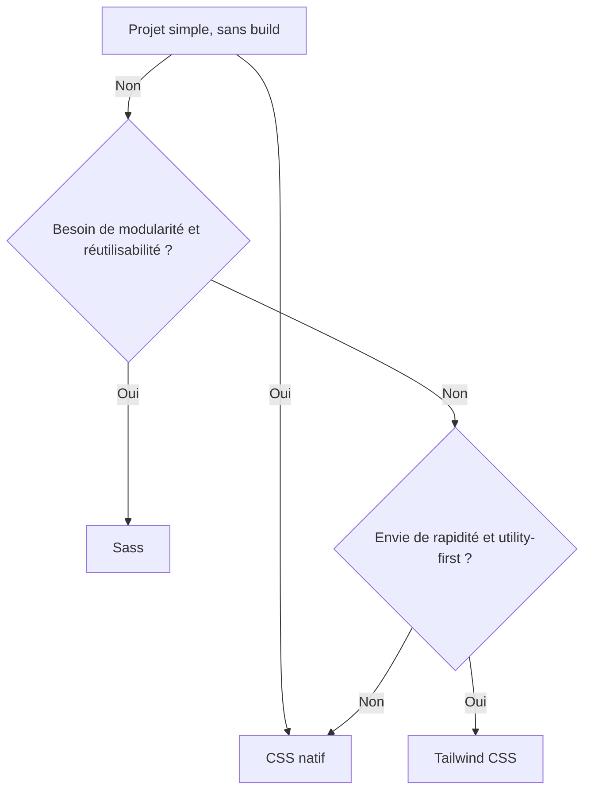

# 01-04-01 - Quand choisir Sass, Tailwind ou CSS natif ?

## Introduction

Le choix entre Sass, Tailwind CSS et le CSS natif dépend des besoins du projet, de la taille de l’équipe, de la complexité du design et des préférences de développement. Chacun de ces outils apporte ses avantages et ses contraintes spécifiques. Cet article propose une analyse structurée et pragmatique pour orienter ce choix en fonction des cas d’usage courants.

---

## 1. CSS natif

### Quand l’utiliser ?

- Projets simples, pages statiques ou prototypes rapides.
- Besoin d’un contrôle basique, sans outils de build.
- Environnements avec contraintes sur les dépendances externes.

### Avantages

- Aucun outil externe nécessaire.
- Contrôle total sur le style.
- Compréhension universelle par tous les développeurs front-end.

### Limites

- Maintenance difficile sur projets complexes.
- Pas de variables, mixins, ou nesting natif (CSS variables et custom properties limités).
- Duplication fréquente de code.

### Exemple

```css
.button {
  background-color: #3490dc;
  padding: 1rem;
  border-radius: 5px;
  color: white;
}
```

---

## 2. Sass

### Quand l’utiliser ?

- Projets de moyenne à grande échelle nécessitant modularité et réutilisabilité.
- Besoin d’automatiser la gestion des styles complexes.
- Collaboration entre équipes avec styles consistants.

### Avantages

- Variables, mixins, fonctions et nesting facilitées.
- Feuilles CSS organisées et modifiables plus facilement.
- Compatible avec tout workflow utilisant des outils de build.

### Limites

- Nécessite un outil de compilation (Dart Sass, etc.).
- Sur-sollicitation pouvant rendre parfois le code complexe.
- Plus de surcharge en apprentissage comparé au CSS natif.

### Exemple

```scss
$primary-color: #3490dc;
@mixin btn-styles {
  background-color: $primary-color;
  padding: 1rem;
  border-radius: 5px;
  color: white;
}

.button {
  @include btn-styles;
}
```

---

## 3. Tailwind CSS

### Quand l’utiliser ?

- Projets nécessitant un prototypage rapide et interface cohérente.
- Préférence pour le utility-first dans HTML sans écrire beaucoup de CSS.
- Environnements capables d’intégrer une pipeline de build moderne.

### Avantages

- Rapidité avec classes utilitaires prêtes à l’emploi.
- Réduction du CSS total grâce à la purge.
- Cohérence et précision dans les styles.
- Facilité de personnalisation via `tailwind.config.js`.

### Limites

- HTML peut devenir verbeux et complexe.
- Courbe d'apprentissage due aux nombreuses classes.
- Pas toujours adapté aux designs très particuliers ou très innovants.

### Exemple

```html
<button class="bg-blue-600 hover:bg-blue-700 text-white font-bold py-2 px-4 rounded">
  Bouton
</button>
```

---

## 4. Tableau comparatif rapide

| Critère                 | CSS natif                | Sass                          | Tailwind CSS                 |
|-------------------------|--------------------------|-------------------------------|------------------------------|
| Complexité projet       | Simple                   | Moyenne à complexe             | De simple à complexe          |
| Besoin d’outils build  | Non                      | Oui                           | Oui                          |
| Réutilisabilité         | Faible                   | Élevée                        | Moyenne à élevée (classes)   |
| Facilité de maintenance | Moyenne                  | Élevée                        | Moyenne à élevée             |
| Temps de prototypage    | Lent                     | Modéré                       | Très rapide                  |
| Lisibilité du code HTML | Très propre              | Propre                        | Plus chargé                  |

---

## 5. Diagramme Mermaid : Choix selon contexte projet



---

## 6. Conclusion

- **CSS natif** reste pertinent pour les petits projets rapides ou aux contraintes techniques strictes.  
- **Sass** est adapté aux projets complexes où la modularité et la maintenabilité sont prioritaires.  
- **Tailwind CSS** se distingue quand la rapidité de prototypage et la cohérence visuelle via classes utilitaires priment, mais demande une maîtrise plus poussée et une chaîne de build.

---

## Sources et références

- [MDN Web Docs - CSS](https://developer.mozilla.org/fr/docs/Web/CSS)
- [Sass Official Documentation](https://sass-lang.com/guide)
- [Tailwind CSS Official Documentation](https://tailwindcss.com/docs/utility-first)
- [CSS-Tricks - Sass vs Tailwind](https://css-tricks.com/utility-first-css/)
- [Smashing Magazine - When to Use Sass or Tailwind CSS](https://www.smashingmagazine.com/2021/02/utility-first-css-tailwind/)

---

Cet article offre un éclairage clair et opérationnel pour choisir judicieusement entre CSS natif, Sass, et Tailwind CSS selon le contexte et les objectifs de développement.