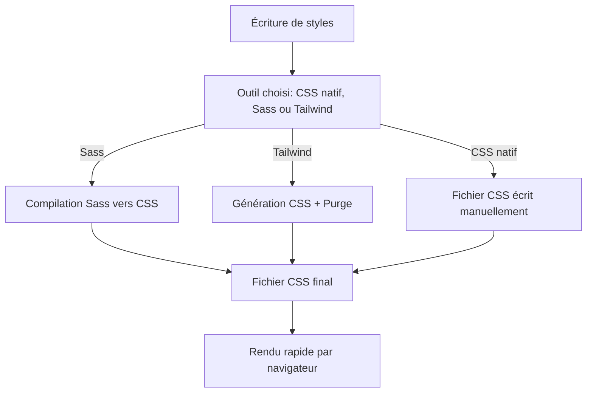

# 01-04-02 - Cas d’usage et performances : Sass vs Tailwind vs CSS natif

## Introduction

Au-delà du simple choix technique, la décision d’utiliser Sass, Tailwind CSS ou CSS natif repose sur la compréhension des cas d’usage spécifiques et des implications en termes de performances. Cet article examine ces éléments afin de guider le choix adapté à un projet.

---

## 1. Cas d’usage spécifiques

### 1.1. CSS natif

**Usage** :  
- Projets simples ou prototypes sans infrastructure de build.  
- Pages statiques ou sites à faible complexité visuelle.  
- Scénarios où un contrôle précis ligne par ligne est requis.

**Exemple** : Une page de destination simple, un email HTML, ou un site microsite.

### 1.2. Sass

**Usage** :  
- Projets avec styles complexes et besoins de modularité.  
- Applications web de taille moyenne à grande.  
- Collaboration d’équipe avec styles structurés et maintenables.

**Exemple** : Un site institutionnel complet avec thèmes personnalisés, variables de couleurs, mixins partageables.

### 1.3. Tailwind CSS

**Usage** :  
- Développement rapide avec design system fixe.  
- Interfaces nécessitant une grande cohérence visuelle via classes utilitaires.  
- Projets disposant d’une chaîne de build moderne et d’une équipe prête à adopter utility-first.

**Exemple** : Dashboards d’applications SaaS, plateformes web avec interfaces homogènes.

---

## 2. Performances liées aux outils

### 2.1. Taille des fichiers CSS générés

| Outil          | Taille CSS initiale | Taille après optimisation/purge |
|----------------|--------------------|---------------------------------|
| CSS natif      | Minimal mais croît avec styles | Variable selon optimisation manuelle |
| Sass           | Peut être volumineux sans contrôle | Optimisable via structuration et purge |
| Tailwind CSS   | Très volumineux à la source (~3MB) | Très réduit (<50KB) grâce à purgeCSS intégrée |

### 2.2. Impact sur le rendu du navigateur

- **CSS natif** : Rendu direct sans étape de compilation; performances dépendent de la qualité du CSS.  
- **Sass** : Nécessite compilation; fichier CSS final optimisé si bien utilisé.  
- **Tailwind** : Livraison de CSS optimisé massivement performant grâce à purge des classes inutilisées.

### 2.3. Performances de développement

- **CSS natif** : Modification laborieuse et sujette aux erreurs dans gros dossiers.  
- **Sass** : Gain via variables et mixins, mais nécessite build.  
- **Tailwind** : Prototypage ultra-rapide, mais courbe d’apprentissage et gestion des listes de classes.

---

## 3. Exemple d’impact sur les performances : PurgeCSS avec Tailwind

```bash
# Extrait basique de purge dans tailwind.config.js
module.exports = {
  content: ['./src/**/*.{html,js,jsx}'],
  theme: {
    extend: {},
  },
  plugins: [],
}
```

PurgeCSS élimine les classes inutilisées, permettant un fichier CSS final minimal.

---

## 4. Diagramme Mermaid : Workflow et impact sur performances



Ce diagramme montre les étapes clés impactant performances au runtime.

---

## 5. Conclusion

- Le **CSS natif** est adapté aux projets simples avec un impact variable sur la maintenabilité et les performances.  
- **Sass** offre un meilleur contrôle sur la structure et la réutilisation, intéressant pour les projets complexes, avec un impact maîtrisé sur la taille finale du CSS.  
- **Tailwind CSS** excelle dans la rapidité de fabrication et la performance runtime grâce à sa purge automatique, mais requiert un environnement de build et une approche différente dans la gestion du style.

---

## Sources et références

- [Tailwind CSS Documentation - PurgeCSS](https://tailwindcss.com/docs/optimizing-for-production)
- [Sass Basics - MDN Web Docs](https://developer.mozilla.org/en-US/docs/Web/CSS/Sass)
- [CSS-Tricks - Utility-First CSS Explained](https://css-tricks.com/utility-first-css/)
- [Performance impacts of CSS - Google Web Fundamentals](https://web.dev/defer-non-critical-css/)
- [Smashing Magazine - Performance considerations with Tailwind CSS](https://www.smashingmagazine.com/2021/04/tailwind-css-modern-css-framework/)

---

Cet article synthétise les impacts fonctionnels et de performance des trois approches, offrant un cadre pour choisir selon objectifs et ressources du projet.