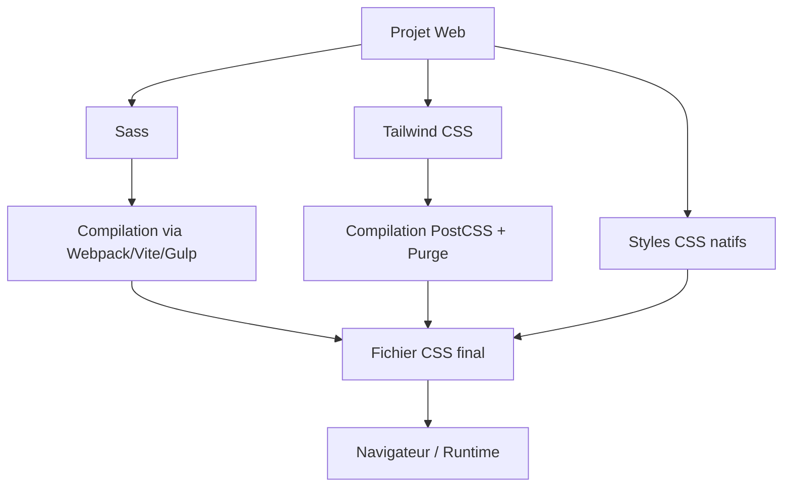

# 01-04-03 - Interopérabilité et intégration dans les projets : Sass vs Tailwind vs CSS natif

## Introduction

Comprendre comment Sass, Tailwind CSS et CSS natif s’intègrent et interopèrent dans différents environnements de développement permet d’anticiper leur adoption et leur gestion dans un projet. Cet article décrit ces aspects, en tenant compte des workflows modernes, des outils et des technologies front-end.

---

## 1. CSS natif : intégration simple et universelle

### 1.1. Simplicité d’intégration

- Le CSS natif est directement exploitable dans tout projet Web sans configuration spécifique.
- Inclusion via `<link>` dans le HTML ou importation dans des fichiers `.html`, `.js` (avec CSS-in-JS), etc.

### 1.2. Interopérabilité

- Compatible avec toutes bibliothèques et frameworks (React, Vue, Angular…).
- Peut coexister avec préprocesseurs et frameworks CSS.

### 1.3. Exemple d’intégration

```html
<link rel="stylesheet" href="styles.css" />
```

Simple, pas besoin d’outils de build, facilité maximale.

---

## 2. Sass : intégration dans un workflow de build

### 2.1. Nécessité d’un environnement de compilation

- Sass est un préprocesseur CSS qui nécessite une compilation en CSS natif via une toolchain (ex: Webpack, Vite, Gulp).
- Intégration avec React, Vue ou Angular via loader Sass (ex: `sass-loader`).

### 2.2. Organisation facilitée

- Permet de structurer styles via imports partiels (`_variables.scss`, `_mixins.scss`) en modules faciles à maintenir.
- Compatible avec les méthodologies BEM, SMACSS, etc.

### 2.3. Exemple d’import dans un projet React

```jsx
import './styles/main.scss';

function App() {
  return <div className="container">Hello Sass</div>;
}
```

---

## 3. Tailwind CSS : intégration au cœur d’une chaîne de build moderne

### 3.1. Dépendance à un environnement Node.js moderne

- Tailwind exige l’utilisation d’outils comme PostCSS, un bundler (Webpack, Vite, Rollup) et la configuration d’un fichier `tailwind.config.js`.
- Cette étape compile et purge le CSS utilitaire pour ne générer que les classes utilisées.

### 3.2. Intégration dans frameworks modernes

- Fonctionne très bien avec React, Vue, Angular via les importations CSS classiques.
- Possibilité d’utiliser dans des projets avec Next.js, Nuxt ou Remix avec hooks dédiés.

### 3.3. Combinaison possible avec Sass ou CSS natif

- Sass peut être utilisé pour écrire certaines feuilles personnalisées en parallèle.
- CSS natif complémentaire pour règles spécifiques ou globales.

### 3.4. Exemple d’import dans un projet Next.js

```js
// Dans _app.js
import 'tailwindcss/tailwind.css';

export default function MyApp({ Component, pageProps }) {
  return <Component {...pageProps} />;
}
```

---

## 4. Diagramme Mermaid : Synthèse des flux d’intégration



---

## 5. Points clés pour choisir selon intégration

| Outil       | Intégration | Outils nécessaires                     | Flexibilité                     |
|-------------|-------------|-------------------------------------|--------------------------------|
| CSS natif   | Direct      | Aucun (éditeur texte suffit)         | Très haut (universel)           |
| Sass        | Build       | Node.js, loader Webpack/Gulp etc.   | Haut (modularité avancée)       |
| Tailwind    | Build       | Node.js, PostCSS, bundler modern     | Très haut (design system strict)|

---

## 6. Conclusion

- Le CSS natif reste la solution la plus souple et simple à intégrer, quel que soit le projet.  
- Sass nécessite une configuration non négligeable mais facilite la modularité dans des environnements avec build.  
- Tailwind CSS s’appuie sur un écosystème moderne pour produire un CSS ultra optimisé, offrant une intégration puissante, surtout avec des frameworks JS modernes.  

---

## Sources et références

- [Tailwind CSS - Installation](https://tailwindcss.com/docs/installation)
- [Sass Lang - Installation](https://sass-lang.com/install)
- [MDN Web Docs - CSS](https://developer.mozilla.org/fr/docs/Web/CSS)
- [React + Sass integration](https://create-react-app.dev/docs/adding-a-sass-stylesheet/)
- [Next.js + Tailwind](https://nextjs.org/docs/basic-features/built-in-css-support#tailwind-css)

---

Cet article aide à comprendre les spécificités d’intégration et d’interopérabilité de Sass, Tailwind et CSS natif pour optimiser la gestion des styles selon les contraintes de projet et de technologies utilisées.