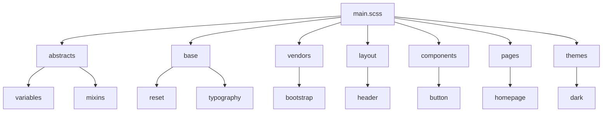

# 02-01-01 - Organisation des fichiers Sass avec le 7-1 Pattern : base, layout, components, utilities, vendors, themes, abstracts

## Introduction

La gestion efficace des styles dans un projet Sass s’appuie souvent sur une organisation claire des fichiers. Le **7-1 pattern** est une approche largement utilisée qui structure le code CSS/Sass en 7 dossiers et 1 fichier principal, facilitant la maintenance, la collaboration et l’évolutivité. Cet article détaille cette organisation et présente chaque dossier avec des exemples.

---

## 1. Présentation du 7-1 Pattern

Le principe consiste à répartir les styles dans sept dossiers thématiques regroupant des fichiers `.scss` spécifiques, puis à importer ces fichiers dans un fichier principal `main.scss` ou `styles.scss`.

### Structure typique

```
sass/
|– abstracts/
|– base/
|– components/
|– layout/
|– pages/
|– themes/
|– vendors/
main.scss
```

---

## 2. Description des dossiers

### 2.1. abstracts/

Contient le code Sass abstrait, non générant directement de CSS, utilisé dans tout le projet :

- Variables (`_variables.scss`)
- Mixins (`_mixins.scss`)
- Fonctions (`_functions.scss`)
- Placeholders (`_placeholders.scss`)

**Exemple :**  
_variables.scss

```scss
$primary-color: #3498db;
$font-stack: 'Helvetica Neue', sans-serif;
```

_mixins.scss

```scss
@mixin clearfix {
  &::after {
    content: "";
    display: table;
    clear: both;
  }
}
```

---

### 2.2. base/

Rassemble les styles globaux et de base appliqués sur l’ensemble du site :

- Reset ou normalize (`_reset.scss`, `_normalize.scss`)
- Styles typographiques (`_typography.scss`)
- Styles globaux (`_base.scss`)
- Styles pour les éléments HTML standards

**Exemple :**

_base.scss

```scss
body {
  font-family: $font-stack;
  color: $primary-color;
  background: #fff;
}
```

---

### 2.3. components/

Regroupe les styles des petits composants réutilisables de l’interface (boutons, cards, modal, sliders…).

**Exemple :**

_button.scss

```scss
.button {
  padding: 10px 20px;
  border-radius: 4px;
  background-color: $primary-color;
  color: white;
  cursor: pointer;

  &:hover {
    background-color: darken($primary-color, 10%);
  }
}
```

---

### 2.4. layout/

Contient les styles définissant la structure générale de la page ou du site : header, footer, sidebar, grid system.

**Exemple :**

_header.scss

```scss
.header {
  width: 100%;
  background: $primary-color;
  padding: 20px;
}
```

---

### 2.5. pages/

Styles spécifiques à certaines pages ou sections, par exemple homepage, contact, about.

```scss
.homepage {
  background: lighten($primary-color, 40%);
}
```

---

### 2.6. themes/

Styles pour gérer différents thèmes (dark mode, light mode, thèmes clients personnalisés).

**Exemple :**

_dark.scss

```scss
body.dark-theme {
  background-color: #222;
  color: #eee;
}
```

---

### 2.7. vendors/

Styles provenant de bibliothèques externes ou plugins, par exemple Bootstrap, Slick carousel, etc.

**Exemple :**

```scss
// Bootstrap overrides
@import 'vendors/bootstrap';
```

---

## 3. Le fichier principal `main.scss`

Il importe tous les fichiers pour générer le CSS final.

```scss
// abstracts
@import 'abstracts/variables';
@import 'abstracts/mixins';

// base
@import 'base/reset';
@import 'base/base';
@import 'base/typography';

// vendors
@import 'vendors/bootstrap';

// layout
@import 'layout/header';
@import 'layout/footer';

// components
@import 'components/button';
@import 'components/card';

// pages
@import 'pages/homepage';

// themes
@import 'themes/dark';
```

---

## 4. Diagramme Mermaid : Organisation du 7-1 Pattern



---

## 5. Conclusion

Le 7-1 pattern constitue une base solide pour organiser ses fichiers Sass de manière modulaire et claire. Cette structure permet d’améliorer la lisibilité, la réutilisation des styles et la collaboration au sein d’une équipe tout en facilitant la maintenance, surtout dans des projets d’envergure.

---

## Sources et références

- [Sass Guidelines - 7-1 Pattern](https://sass-guidelin.es/#the-7-1-pattern)
- [Smashing Magazine - Sass Architecture Patterns](https://www.smashingmagazine.com/2018/05/sass-architecture-patterns/)
- [CSS-Tricks - Organizing Sass Projects](https://css-tricks.com/structuring-sass-projects/)
- [Sass Lang - Official Documentation](https://sass-lang.com/guide)

---

Cet article sert de référence claire pour appliquer efficacement le 7-1 pattern dans l’organisation des fichiers Sass.