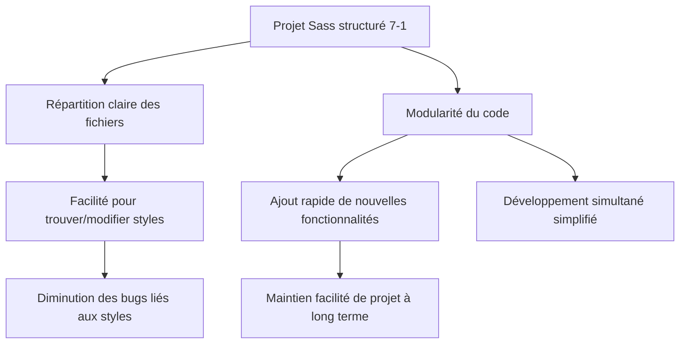

# 02-01-02 - Avantages du 7-1 Pattern pour la maintenabilité et la scalabilité avec Sass

## Introduction

L'organisation des fichiers Sass avec le **7-1 pattern** ne sert pas uniquement à structurer le code. Ce modèle apporte des bénéfices concrets en termes de maintenabilité et de scalabilité des feuilles de style. Cet article expose ces avantages, appuyés par des exemples et illustrations claires.

---

## 1. Maintenabilité améliorée

### 1.1. Clarification de la structure

Grâce au découpage en sept dossiers thématiques distincts, chaque développeur sait où trouver ou placer un fichier selon sa fonction (variables, composants, layouts, etc.). Cela limite les zones d’ombre, facilite la revue de code et réduit les risques d’introduire des styles non cohérents ou en doublon.

### 1.2. Réduction des conflits

La séparation des styles par fonction et portée réduit la probabilité de chevauchement entre règles CSS. Par exemple, les fichiers `_components/_button.scss` ne contiennent que les règles relatives aux boutons, évitant la contamination involontaire des styles de layout.

### 1.3. Extrait d’une erreur courante évitée

```scss
// Mauvaise organisation : styles button dans global.scss
.button {
  background: blue;
  margin-top: 10px; // Peut impacter l’ensemble du layout si réutilisé mal
}

// Avec 7-1 pattern dans components/_button.scss
.button {
  background: blue;
  margin: 10px 0;
}
```

---

## 2. Scalabilité facilitée

### 2.1. Ajout et modification simples

La structure modulaire permet d’ajouter un nouveau composant, thème ou layout sans impacter le reste du projet. On ajoute simplement un fichier dans le dossier adéquat et on inclut dans le fichier principal.

### 2.2. Chargement sélectif

En gros projets, certains build tools permettent d’importer uniquement les parties nécessaires, réduisant la taille du CSS produit. La séparation nette des fichiers rend ce processus plus efficace.

### 2.3. Evolution indépendante

Dans une grande équipe, plusieurs développeurs peuvent travailler simultanément sur des parties différentes (themes, components...), ce qui minimise la nécessité de fusion manuelle.

---

## 3. Exemple d’évolution d’un projet

Supposons l’ajout d’un nouveau thème sombre.

- Créer `_themes/_dark.scss`  
- Écrire les styles spécifiques au thème  
- Ajouter `@import 'themes/dark';` dans `main.scss`

Cela ne modifie aucun fichier existant, évitant risques et conflits.

---

## 4. Diagramme Mermaid : Maintenabilité et scalabilité avec 7-1 pattern



---

## 5. Résultats concrets

- **Gains de temps** lors des développements et débogages  
- **Amélioration de la collaboration** par une meilleure lisibilité  
- **Réduction de dette technique** liée au CSS redondant ou non maintenable  
- **Facilité d’intégration des évolutions** et nouveaux besoins fonctionnels  

---

## Sources et références

- [Sass Guidelines - 7-1 Pattern avantages](https://sass-guidelin.es/#the-7-1-pattern)  
- [Smashing Magazine - Why Modular CSS Matters](https://www.smashingmagazine.com/2019/08/guide-modular-css-architecture/)  
- [CSS-Tricks - Organizing Sass Projects](https://css-tricks.com/structuring-sass-projects/)  
- [Frontend Masters - CSS Architecture](https://frontendmasters.com/courses/css-in-js-sass/#architecture-overview)

---

## Conclusion

Le 7-1 pattern optimise la gestion des projets Sass en rendant le code plus lisible, modulaire et évolutif. Ces qualités sont déterminantes pour garantir la maintenabilité sur des projets complexes ou en forte croissance. Appliquer ce modèle structurera votre travail et facilitera la collaboration.