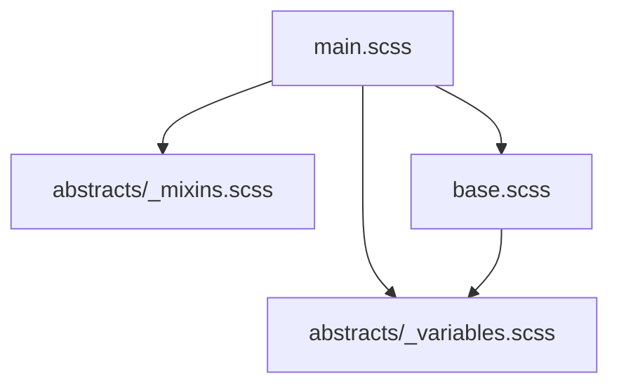

# 02-02-01 - Partial Files et Import : Modularité avec Sass

## Introduction

La modularité est un pilier de la gestion efficace des feuilles de style avec Sass. Elle s’appuie notamment sur l’usage des **partial files** et de la directive `@import`, qui permettent de découper le code en unités fonctionnelles réutilisables et maintenables. Cet article présente ces concepts, leur syntaxe et leurs bonnes pratiques.

---

## 1. Partial files en Sass

### 1.1. Définition

Un **partial file** est un fichier Sass dont le nom commence par un underscore (`_`), par exemple `_variables.scss`. Ces fichiers ne génèrent pas directement de CSS lors de la compilation, ils servent uniquement à être importés dans d’autres fichiers.

### 1.2. Avantages

- Permet de découper le code en modules logiques (variables, mixins, composants).
- Favorise la réutilisation et la maintenance.
- Évite les doublons et facilite la collaboration.

### 1.3. Exemple

Structure de fichiers :

```
sass/
|– abstracts/
|   |_variables.scss
|   |_mixins.scss
|– base.scss
```

Le fichier `_variables.scss` contient :

```scss
$primary-color: #3498db;
$font-stack: 'Helvetica Neue', sans-serif;
```

---

## 2. Directive `@import` dans Sass

### 2.1. Fonctionnement

La directive `@import` permet d’inclure un partial ou un fichier Sass dans un autre fichier. Lors de la compilation, tous les imports sont réunis en un seul fichier CSS.

### 2.2. Syntaxe

Pour importer `_variables.scss` dans `base.scss`, on écrit :

```scss
@import 'abstracts/variables';
```

> Note : L’underscore et l’extension `.scss` sont optionnels dans l’import.

### 2.3. Exemple complet

`base.scss`

```scss
@import 'abstracts/variables';

body {
  font-family: $font-stack;
  color: $primary-color;
}
```

Après compilation, aucun fichier `_variables.scss` n’existe séparément, seul le CSS généré est produit.

---

## 3. Remarque sur la directive `@use` (nouvelle syntaxe)

Depuis Sass 1.23.0+, il est recommandé d’utiliser la directive `@use`, qui apporte :

- Une meilleure isolation des namespaces.
- Evite les conflits de noms.
- Une approche plus modulaire.

**Exemple avec `@use` :**

```scss
// abstracts/_variables.scss
$primary-color: #3498db !default;

// base.scss
@use 'abstracts/variables' as vars;

body {
  font-family: 'Helvetica Neue', sans-serif;
  color: vars.$primary-color;
}
```

Cette syntaxe empêche la pollution globale et clarifie la provenance des variables.

---

## 4. Diagramme Mermaid : Flux d’importation Sass avec partials



---

## 5. Utilisation recommandée

| Usage                            | Directive recommandée |
|---------------------------------|----------------------|
| Projet existant sans migration   | `@import`            |
| Nouveau projet ou migration      | `@use`               |

---

## 6. Sources et références

- [Sass Documentation - Partial Files](https://sass-lang.com/guide#topic-partials)  
- [Sass Documentation - @import](https://sass-lang.com/documentation/at-rules/import)  
- [Sass Documentation - @use](https://sass-lang.com/documentation/at-rules/use)  
- [CSS-Tricks - Sass @use vs @import](https://css-tricks.com/a-guide-to-sass-@use-and-@forward/)  
- [Smashing Magazine - Sass Modular Architecture](https://www.smashingmagazine.com/2018/05/sass-architecture-patterns/)

---

## Conclusion

Les partial files et la directive `@import` sont au cœur de la modularité Sass, facilitant la découpe et la réutilisation du code CSS. Pour des projets modernes et évolutifs, la nouvelle syntaxe `@use` permet un contrôle plus précis des namespaces et une gestion plus propre des dépendances. Maîtriser ces concepts améliore considérablement la qualité et la maintenabilité de vos feuilles de style.