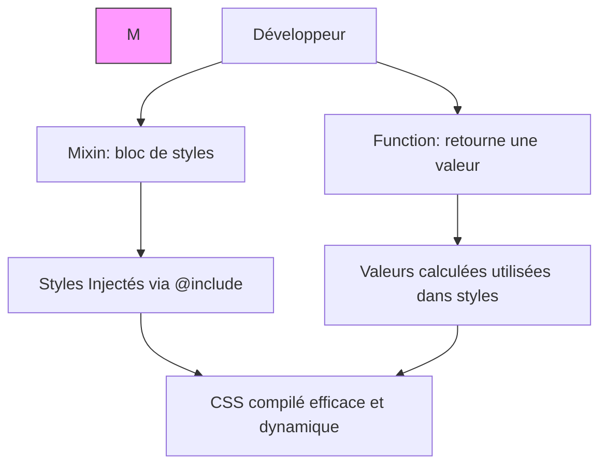

# 02-02-02 - Mixins et Fonctions Personnalisées en Sass : Modularité et Réutilisabilité

## Introduction

Sass permet d’écrire du code CSS plus maintenable et modulaire grâce à deux fonctionnalités puissantes : les **mixins** et les **fonctions personnalisées**. Elles facilitent la réutilisation de blocs de styles et la création dynamique de valeurs. Cet article présente leur usage, syntaxe, et cas pratiques.

---

## 1. Les Mixins en Sass

### 1.1. Définition

Un **mixin** est un bloc de code Sass réutilisable qui peut accepter des arguments et être inclus dans d’autres règles CSS, évitant la duplication de code.

### 1.2. Syntaxe

```scss
@mixin nom-du-mixin($parametre1, $parametre2: valeur-par-defaut) {
  propriété: valeur;
  // autres règles
}
```

Pour appliquer le mixin :

```scss
@include nom-du-mixin(argument1, argument2);
```

### 1.3. Exemple pratique : mixin bouton personnalisable

```scss
@mixin bouton($bg-color, $padding: 10px 20px) {
  background-color: $bg-color;
  padding: $padding;
  border-radius: 4px;
  color: white;
  cursor: pointer;

  &:hover {
    background-color: darken($bg-color, 10%);
  }
}

.button-primary {
  @include bouton(#3498db);
}

.button-secondary {
  @include bouton(#2ecc71, 8px 16px);
}
```

---

## 2. Les Fonctions personnalisées en Sass

### 2.1. Rôle

Les fonctions Sass calculent et retournent une valeur, que l’on peut utiliser dans des propriétés CSS. Elles permettent de générer dynamiquement des valeurs complexes.

### 2.2. Syntaxe

```scss
@function nom-de-la-fonction($param1, $param2) {
  @return valeur-calculée;
}
```

### 2.3. Exemple : fonction pour convertir px en rem

```scss
@function px-to-rem($px, $base: 16) {
  @return ($px / $base) * 1rem;
}

body {
  font-size: px-to-rem(18);
}
```

---

## 3. Comparaison des usages

| Fonctionnalité       | Usage principal                        | Avantage principal           |
|---------------------|-------------------------------------|-----------------------------|
| Mixins              | Réutiliser bloc de propriétés CSS    | Évite duplication de code   |
| Fonctions           | Calculer et retourner une valeur     | Dynamise la création des valeurs |

---

## 4. Bonnes pratiques

- Limiter la taille des mixins pour éviter un CSS final trop volumineux.  
- Privilégier les fonctions pour les calculs simples.  
- Documenter les paramètres pour faciliter la compréhension.  
- Organiser les mixins et fonctions dans un dossier abstrait (`abstracts/_mixins.scss`, `abstracts/_functions.scss`).

---

## 5. Diagramme Mermaid :  Workflow mixins et fonctions dans Sass



---

## Sources et références

- [Sass Official Documentation - Mixins](https://sass-lang.com/documentation/at-rules/mixin)  
- [Sass Official Documentation - Functions](https://sass-lang.com/documentation/at-rules/function)  
- [CSS-Tricks - Using Sass Mixins and Functions](https://css-tricks.com/sass-mixins-functions/)  
- [Smashing Magazine - Sass Modular Architecture](https://www.smashingmagazine.com/2018/05/sass-architecture-patterns/)

---

## Conclusion

Les mixins et fonctions personnalisées Sass constituent des outils puissants pour le développement CSS modulaire et évolutif. Ils permettent d’éviter les répétitions, de rendre le code plus dynamique et de faciliter sa maintenance. Intégrer ces concepts maximise la qualité et la scalabilité des projets front-end.