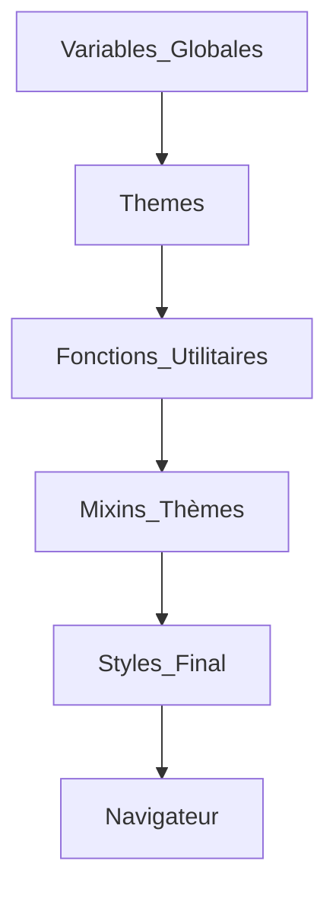

# 02-02-03 - Gestion des thèmes et variables globales avec Sass

## Introduction

La gestion des thèmes et des variables globales est une pratique courante en développement CSS pour assurer cohérence stylistique et flexibilité dans les projets. Sass apporte des outils puissants pour organiser ces éléments via des variables, des maps et des mixins, facilitant la création de thèmes (ex : clair/sombre) et la maintenance centralisée des styles.

---

## 1. Variables globales en Sass

### 1.1. Déclaration des variables

Sass permet de définir des variables globales avec la syntaxe `$nom-variable: valeur;`. Ces variables sont accessibles partout une fois importées.

**Exemple :**

```scss
// abstracts/_variables.scss
$primary-color: #3498db;
$secondary-color: #2ecc71;
$font-stack: 'Helvetica Neue', sans-serif;
```

### 1.2. Utilisation

```scss
body {
  font-family: $font-stack;
  color: $primary-color;
}
```

Cette centralisation permet de changer facilement une couleur ou une police dans tout le projet.

---

## 2. Gestion de thèmes avec des Maps Sass

### 2.1. Les maps pour thèmes

Les maps Sass permettent de regrouper des styles liés à un thème en une structure clé-valeur, facilitant le passage d'un thème à un autre.

**Exemple avec un thème clair et un thème sombre :**

```scss
// abstracts/_themes.scss
$themes: (
  light: (
    background: #ffffff,
    text: #222222,
    primary: #3498db,
  ),
  dark: (
    background: #222222,
    text: #eeeeee,
    primary: #9b59b6,
  )
);
```

### 2.2. Fonction d’accès aux couleurs du thème

```scss
@function theme-color($theme, $key) {
  @return map-get(map-get($themes, $theme), $key);
}
```

---

## 3. Application dynamique des thèmes

### 3.1. Mixin pour appliquer un thème

```scss
@mixin apply-theme($theme) {
  background-color: theme-color($theme, background);
  color: theme-color($theme, text);

  a {
    color: theme-color($theme, primary);
  }
}
```

### 3.2. Exemple d’utilisation

```scss
body.light-mode {
  @include apply-theme(light);
}

body.dark-mode {
  @include apply-theme(dark);
}
```

---

## 4. Diagramme Mermaid : architecture de gestion des thèmes avec Sass



---

## 5. Avantages de cette approche

- **Centralisation** : variables et thèmes réunis facilitent la modification globale.
- **Modularité** : thèmes isolés dans des maps, facilement extensibles (ajout d’un nouveau thème).
- **Réutilisation** : mixins et fonctions rendent les styles faciles à appliquer sur différentes sections.
- **Clarté** : code plus lisible, facilite la compréhension et la maintenance.

---

## 6. Sources et références

- [Sass: Official Guide on Variables and Maps](https://sass-lang.com/documentation/values/variables)  
- [Sass: Maps Documentation](https://sass-lang.com/documentation/values/maps)  
- [CSS-Tricks: Using Sass Maps for Theming](https://css-tricks.com/using-sass-maps-to-structure-themes/)  
- [Smashing Magazine: Sass Architecture and Theming](https://www.smashingmagazine.com/2018/05/sass-architecture-patterns/)  
- [Sass Guidelines - Theming](https://sass-guidelin.es/#theming)

---

## Conclusion

Utiliser les variables globales et les maps en Sass pour gérer les thèmes est une méthode puissante qui améliore la flexibilité et la maintenabilité des projets CSS. Cette organisation assure une adaptation facile de l’apparence globale du site aux besoins fonctionnels, comme la prise en charge du dark mode ou des variations graphiques clients.