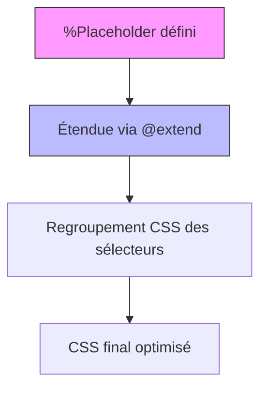

# 02-03-03 - Extensions avec `@extend` et Placeholders en Sass

## Introduction

Sass offre des mécanismes puissants pour optimiser et organiser les styles grâce à la directive `@extend` et aux **placeholders**. Ces outils facilitent la réutilisation de blocs CSS communs tout en évitant le code dupliqué dans les fichiers compilés. Cet article explique leur fonctionnement, avantages et bonnes pratiques.

---

## 1. Directive `@extend` : principe et fonctionnement

`@extend` permet à un sélecteur d’hériter des propriétés d’un autre sélecteur CSS. Contrairement aux mixins, `@extend` ne copie pas le code mais fusionne les sélecteurs dans le CSS généré.

### Exemple simple

```scss
.message {
  padding: 10px;
  border: 1px solid #ccc;
  color: #333;
}

.success {
  @extend .message;
  border-color: green;
}

.error {
  @extend .message;
  border-color: red;
}
```

**CSS généré :**

```css
.message, .success, .error {
  padding: 10px;
  border: 1px solid #ccc;
  color: #333;
}

.success {
  border-color: green;
}

.error {
  border-color: red;
}
```

---

## 2. Placeholders `%` : sélecteurs sans sortie CSS directe

Les placeholders sont des sélecteurs Sass qui ne génèrent aucun CSS tant qu'ils ne sont pas étendus avec `@extend`. Ils sont définis avec un préfixe `%`.

### Exemple

```scss
%btn-base {
  padding: 8px 15px;
  border-radius: 4px;
  cursor: pointer;
  font-weight: bold;
}

.btn-primary {
  @extend %btn-base;
  background-color: blue;
  color: white;
}

.btn-secondary {
  @extend %btn-base;
  background-color: gray;
  color: black;
}
```

*Avantage :* Le placeholder n’existe pas en CSS sauf s’il est étendu, ce qui évite des sélecteurs inutiles.

---

## 3. `@extend` vs mixins

| Aspect            | `@extend`                               | mixins                         |
|-------------------|----------------------------------------|-------------------------------|
| Génération CSS    | Regroupe sélecteurs, pas de duplication | Copie complète du code         |
| Utilisation       | Utilisé pour partager des styles communs | Utilisé pour réutiliser des blocs paramétrables |
| Performance CSS   | CSS plus léger mais attention aux sélecteurs spécifiques | Peut générer CSS plus volumineux |
| Limitations       | Ne fonctionne qu’avec des sélecteurs      | Plus flexible (fonctions dans mixins…) |

---

## 4. Bonnes pratiques avec `@extend` et placeholders

- Utiliser `%placeholders` pour des styles de base récurrents et éviter la duplication.
- Ne pas étendre des sélecteurs complexes ou trop spécifiques pour éviter des sélecteurs CSS trop lourds.
- Préférer les placeholders dans la conception d’un système de design modulaire.
- Utiliser les mixins quand les styles doivent accepter des paramètres.

---

## 5. Diagramme Mermaid : interaction entre `@extend` et placeholders



---

## 6. Exemple avancé combinant placeholders et `@extend`

```scss
// Définition du placeholder
%card {
  background: white;
  border-radius: 6px;
  box-shadow: 0 2px 5px rgba(0, 0, 0, 0.1);
  padding: 20px;
}

.card-primary {
  @extend %card;
  border-left: 5px solid #3498db;
}

.card-danger {
  @extend %card;
  border-left: 5px solid #e74c3c;
}
```

---

## 7. Sources et références

- [Sass Official Documentation - @extend](https://sass-lang.com/documentation/at-rules/extend)  
- [Sass Official Documentation - Placeholders](https://sass-lang.com/documentation/style-rules/placeholder-selectors)  
- [CSS-Tricks - Sass @extend](https://css-tricks.com/the-difference-between-extend-and-mixins-in-sass/)  
- [Smashing Magazine - Advanced Sass Techniques](https://www.smashingmagazine.com/2018/05/sass-architecture-patterns/#using-extend)  

---

## Conclusion

L’utilisation combinée des placeholders et de la directive `@extend` permet d’optimiser la production CSS en regroupant les sélecteurs et réduisant la duplication. Ils jouent un rôle clé dans une architecture Sass propre et maintenable, particulièrement adaptée aux systèmes de design. Connaître leurs limites et avantages est essentiel pour une gestion efficace des styles dans des projets complexes.