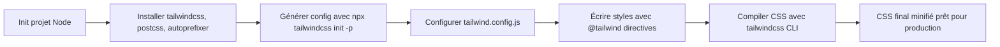

# 03-01-01 - Installation de Tailwind CSS avec npm/yarn

## Introduction

Tailwind CSS est un framework CSS utility-first qui permet de construire des interfaces rapidement grâce à des classes utilitaires préconçues. Son installation via npm ou yarn s’inscrit dans les workflows modernes de développement frontend. Cet article décrit les étapes exactes pour intégrer Tailwind CSS dans un projet web, avec exemples pratiques.

---

## 1. Prérequis

Assurez-vous d’avoir :

- Node.js installé (version recommandée ≥ 12.x)  
- Un projet initialisé avec npm (`npm init -y`) ou yarn (`yarn init -y`)  

---

## 2. Installation de Tailwind CSS

### 2.1. Installer Tailwind CSS via npm ou yarn

Dans le terminal, positionnez-vous à la racine de votre projet, puis exécutez :

```bash
# Avec npm
npm install -D tailwindcss postcss autoprefixer

# Avec yarn
yarn add -D tailwindcss postcss autoprefixer
```

Ces trois paquets sont essentiels :  
- **tailwindcss** : moteur principal  
- **postcss** : outil de transformation CSS (nécessaire pour Tailwind)  
- **autoprefixer** : ajoute les préfixes CSS nécessaires pour compatibilité navigateurs

### 2.2. Initialiser la configuration Tailwind

Générez la configuration par défaut de Tailwind et PostCSS avec :

```bash
npx tailwindcss init -p
```

Cela crée deux fichiers :  
- `tailwind.config.js` : pour personnaliser Tailwind  
- `postcss.config.js` : pour configurer PostCSS

---

## 3. Structure de base pour utiliser Tailwind CSS

### 3.1. Fichier CSS principal

Créez un fichier CSS principal (par exemple `src/styles.css`) et ajoutez les directives Tailwind :

```css
@tailwind base;
@tailwind components;
@tailwind utilities;
```

Ces directives importent respectivement les styles de base, les composants et les utilitaires.

### 3.2. Configuration `tailwind.config.js`

Le fichier `tailwind.config.js` permet de configurer les chemins des fichiers sources qui utilisent Tailwind :

```js
/** @type {import('tailwindcss').Config} */
module.exports = {
  content: [
    "./src/**/*.{html,js}",  // indique où Tailwind doit rechercher les classes CSS utilisées
  ],
  theme: {
    extend: {},
  },
  plugins: [],
}
```

Cette configuration est essentielle pour la purge des classes CSS inutilisées en production.

---

## 4. Intégration dans un workflow de build

Pour construire le fichier CSS final, configurez un script dans `package.json` :

```json
"scripts": {
  "build:css": "tailwindcss -i ./src/styles.css -o ./dist/styles.css --minify"
}
```

Puis lancez la compilation avec :

```bash
npm run build:css
# ou
yarn build:css
```

Le fichier CSS minifié sera généré dans `./dist/styles.css` prêt à être utilisé dans votre projet.

---

## 5. Diagramme Mermaid : installation et flux de traitement Tailwind CSS



---

## 6. Conseils pratiques

- Toujours configurer précisément le champ `content` pour éviter la génération de CSS inutile.  
- Utiliser Tailwind CLI ou intégrer Tailwind dans un bundler (Webpack, Vite, etc.) pour automatiser le build.  
- Le fichier `postcss.config.js` créé par défaut contient souvent cette configuration minimale :

```js
module.exports = {
  plugins: {
    tailwindcss: {},
    autoprefixer: {},
  },
}
```

- En développement, utiliser l’option `--watch` pour rafraîchir le CSS en temps réel.

---

## 7. Sources et références

- [Tailwind CSS Documentation - Installation](https://tailwindcss.com/docs/installation)  
- [Tailwind CSS - Using Tailwind CLI](https://tailwindcss.com/docs/installation#using-tailwind-via-cli)  
- [PostCSS Official Site](https://postcss.org/)  
- [Autoprefixer GitHub](https://github.com/postcss/autoprefixer)  
- [MDN Web Docs - npm](https://developer.mozilla.org/en-US/docs/Learn/Tools_and_testing/Client-side_JavaScript_frameworks/Installing_node_modules)

---

## Conclusion

L’installation de Tailwind CSS avec npm ou yarn s’intègre facilement dans un workflow moderne. La séparation claire entre configuration, styles sources et build final simplifie la maintenance et optimise les performances. En maîtrisant ces étapes, vous posez les bases d’un développement frontend rapide et efficace avec Tailwind.