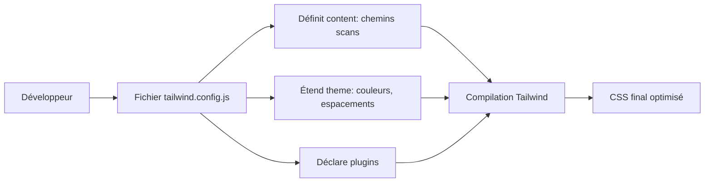

# 03-01-02 - Configuration du fichier `tailwind.config.js`

## Introduction

Le fichier `tailwind.config.js` est le cœur de la personnalisation dans Tailwind CSS. Il permet d’adapter le framework aux besoins spécifiques de votre projet en configurant les sources de contenu, en étendant le thème par défaut, en ajoutant des plugins, ou en modifiant la purge CSS. Cet article détaille la structure, les principales options et fournit des exemples concrets de configuration.

---

## 1. Génération du fichier `tailwind.config.js`

Après l’installation initiale, générez ce fichier avec la commande :

```bash
npx tailwindcss init
```

Pour créer un fichier avec la configuration PostCSS (incluant `postcss.config.js`), utilisez :

```bash
npx tailwindcss init -p
```

---

## 2. Structure principale du fichier

Un fichier `tailwind.config.js` minimal ressemble à ceci :

```js
/** @type {import('tailwindcss').Config} */
module.exports = {
  content: ["./src/**/*.{html,js}"],
  theme: {
    extend: {},
  },
  plugins: [],
}
```

- **content** : chemins vers les fichiers source où Tailwind recherche les classes utilisées (pour purge CSS).  
- **theme** : objet pour personnaliser ou étendre les styles par défaut (couleurs, espacements, polices, etc.).  
- **plugins** : tableau permettant d’ajouter des fonctionnalités via plugins officiels ou tiers.

---

## 3. Configuration du champ `content`

Pour optimiser la taille CSS finale, spécifiez précisément où Tailwind doit chercher les classes CSS utilisées.

**Exemples :**

```js
content: [
  "./index.html",
  "./src/**/*.{html,js,jsx,ts,tsx}",
]
```

Cet exemple inclut la racine `index.html` et tous les fichiers HTML & JS dans `src`. Respecter cette configuration est important pour la purge efficace en production.

---

## 4. Extending the default theme

Pour ajouter ou modifier des valeurs dans le thème, utilisez la clé `extend` :

### Exemple : ajout de couleurs personnalisées

```js
theme: {
  extend: {
    colors: {
      brandBlue: '#1fb6ff',
      brandPink: '#ff49db',
    },
    spacing: {
      '128': '32rem',
      '144': '36rem',
    },
  },
}
```

Vous pouvez ainsi utiliser des classes comme `bg-brandBlue` ou `p-128`.

---

## 5. Ajout de plugins Tailwind

Tailwind permet d’utiliser des plugins pour enrichir les utilitaires.

### Exemple : intégration du plugin forms officiel

Installez le plugin :

```bash
npm install @tailwindcss/forms
# ou
yarn add @tailwindcss/forms
```

Puis ajoutez-le dans la configuration :

```js
plugins: [
  require('@tailwindcss/forms'),
],
```

---

## 6. Exemples avancés

### Ajout de variants (responsive, hover, focus, dark mode)

Pour activer le dark mode par classe dans la config :

```js
module.exports = {
  darkMode: 'class', // ou 'media' (préférences OS)
  content: [/* chemins */],
  theme: { extend: {} },
  plugins: [],
}
```

Utilisation dans CSS : 

```html
<body class="dark">
  <div class="bg-white dark:bg-gray-800 text-black dark:text-white">
    ...
  </div>
</body>
```

---

## 7. Diagramme Mermaid : Flux de configuration Tailwind



---

## 8. Conseils pratiques

- Toujours limiter le champ `content` à vos fichiers sources pour une purge CSS efficace.  
- Préférez l'extension via `extend` pour ne pas écraser la configuration par défaut (utile pour thèmes, breakpoints).  
- Utilisez les plugins officiels (forms, typography, aspect-ratio, line-clamp) pour enrichir Tailwind sans surcharge de code.  
- Activez le `darkMode` selon vos besoins (`class` est souvent recommandé pour le contrôle explicite).

---

## 9. Sources et références

- [Tailwind CSS Documentation - Configuration](https://tailwindcss.com/docs/configuration)  
- [Tailwind CSS Documentation - Dark Mode](https://tailwindcss.com/docs/dark-mode)  
- [Tailwind CSS Plugins](https://tailwindcss.com/docs/plugins)  
- [GitHub - TailwindCSS Forms Plugin](https://github.com/tailwindlabs/tailwindcss-forms)  
- [PostCSS Configuration Guide](https://tailwindcss.com/docs/installation#post-css-7-compatibility-build)

---

## Conclusion

Le fichier `tailwind.config.js` est un point central de personnalisation qui permet d’adapter Tailwind CSS à vos besoins spécifiques. Bien configurer les chemins de contenu, étendre le thème avec des valeurs personnalisées et intégrer les plugins appropriés améliorent à la fois l’efficacité et la qualité du CSS généré.