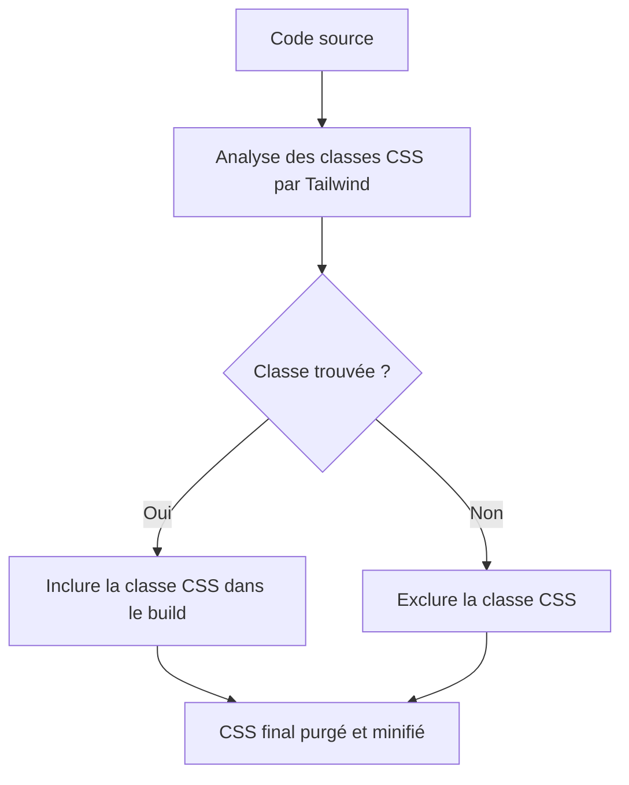

# 03-01-03 - Purge des classes inutilisées dans Tailwind CSS

## Introduction

Tailwind CSS génère par défaut une vaste quantité de classes utilitaires, ce qui peut entraîner un fichier CSS final très volumineux. La **purge** consiste à supprimer du bundle final toutes les classes CSS non utilisées dans le projet, optimisant ainsi le poids des fichiers et les performances. Cet article détaille le mécanisme de purge, sa configuration et des astuces pour la maîtriser efficacement.

---

## 1. Le principe du purge dans Tailwind

Le processus de purge analyse vos fichiers source (HTML, JS, Vue, React, etc.) pour détecter les classes CSS réellement utilisées et élimine celles absentes. La purge est activée automatiquement en mode production via la configuration `content` dans `tailwind.config.js`.

---

## 2. Configuration de la purge via le champ `content`

Dans `tailwind.config.js` :

```js
module.exports = {
  content: [
    "./src/**/*.{html,js,jsx,ts,tsx}",
    "./public/index.html",
  ],
  theme: {
    extend: {},
  },
  plugins: [],
}
```

**Explications :**

- `content` contient un tableau des chemins vers les fichiers à scanner  
- Incluez tous les fichiers qui contiennent des classes Tailwind utilisées en dur ou dynamiques  
- Laissez l’extension libre pour capturer tous types de fichiers (html, js, jsx, etc.)

---

## 3. Fonctionnement en environnement de développement vs production

- En **mode développement**, Tailwind génère toutes les classes pour la complétion et flexibilité rapide.  
- En **mode production**, la purge réduit le CSS au strict nécessaire.

### Exemple de script dans `package.json` :

```json
"scripts": {
  "build": "tailwindcss -i ./src/styles.css -o ./dist/styles.css --minify"
}
```

Lors de ce build, Tailwind utilise la configuration `content` pour purger automatiquement.

---

## 4. Cas particuliers : classes dynamiques et safelist

Si vous générez dynamiquement des classes (ex : `bg-${color}`) mais qu’elles n’apparaissent pas explicitement dans vos fichiers, elles seront purgées.

Pour les garder, utilisez l’option `safelist` :

```js
module.exports = {
  content: ["./src/**/*.{js,jsx,ts,tsx,html}"],
  safelist: [
    'bg-red-500',
    'text-center',
    /^bg-/ // regex pour toutes les classes commençant par bg-
  ],
  theme: {extend: {}},
  plugins: [],
}
```

---

## 5. Exemple de configuration complète avec safelist

```js
module.exports = {
  content: [
    "./src/**/*.{js,jsx,ts,tsx,vue}",
    "./public/index.html",
  ],
  safelist: [
    'hidden',
    'block',
    /^text-/,
  ],
  theme: {
    extend: {
      colors: {
        customBlue: '#1DA1F2',
      }
    }
  },
  plugins: [],
}
```

---

## 6. Diagramme Mermaid : Processus de purge Tailwind



---

## 7. Bonne pratique et recommandations

- Spécifiez précisément le champ `content` avec tous les fichiers sources pour ne rien exclure par erreur.  
- Utilisez la `safelist` pour les classes CSS générées dynamiquement ou via JavaScript.  
- Testez toujours le CSS final en production pour vérifier qu’aucune classe nécessaire n’a été supprimée.  
- Activez la purge uniquement en production afin de conserver un workflow rapide en développement.

---

## 8. Sources et références

- [Tailwind CSS Documentation - Controlling File Size](https://tailwindcss.com/docs/just-in-time-mode#controlling-file-size)  
- [Tailwind CSS Documentation - Configuration - content](https://tailwindcss.com/docs/configuration#content)  
- [Tailwind CSS Documentation - Safelisting](https://tailwindcss.com/docs/content-configuration#safelisting-classes)  
- [CSS-Tricks - Purging Unused Tailwind CSS Styles](https://css-tricks.com/purging-unused-tailwind-css-styles-with-next-js/)  
- [PostCSS and PurgeCSS](https://purgecss.com/)

---

## Conclusion

La purge dans Tailwind CSS est un mécanisme indispensable pour optimiser la taille finale du CSS en supprimant les classes inutilisées. Une bonne configuration du champ `content` et une gestion fine de la safelist garantissent que seuls les styles réellement appliqués sur le site seront inclus, ce qui accélère le chargement et améliore l’expérience utilisateur.