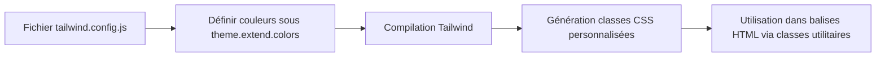

# 03-02-01 - Définition de thèmes et palettes de couleurs dans Tailwind CSS

## Introduction

Tailwind CSS propose une palette de couleurs par défaut, mais la personnalisation des thèmes permet d’adapter précisément votre design system à l’identité visuelle de votre projet. La définition de palettes personnalisées dans le fichier `tailwind.config.js` offre une grande flexibilité pour gérer couleurs, nuances, et variantes. Cet article explique comment définir et étendre les thèmes de couleurs dans Tailwind.

---

## 1. Le système de couleurs dans Tailwind CSS

Tailwind fournit des couleurs prédéfinies comme `blue`, `red`, `green`, chaque couleur étant déclinée en plusieurs nuances (`blue-50`, `blue-100`, etc.). Ces couleurs sont accessibles via la clé `colors` dans la configuration.

---

## 2. Personnalisation de la palette via `tailwind.config.js`

Pour modifier ou étendre les couleurs, on utilise la clé `theme.extend.colors` :

### Exemple d’extension simple

```js
// tailwind.config.js
module.exports = {
  theme: {
    extend: {
      colors: {
        brand: {
          light: '#3ABFF8',
          DEFAULT: '#0ea5e9',
          dark: '#035A9E',
        },
        'cool-gray': {
          100: '#f5f7fa',
          200: '#e4e7eb',
          300: '#cbd2d9',
        },
      },
    },
  },
}
```

Ici on ajoute une nouvelle palette `brand` disponible via `bg-brand-light`, `bg-brand`, `bg-brand-dark`, etc.

---

## 3. Remplacement complet de la palette

Si vous souhaitez remplacer complètement la palette par défaut :

```js
module.exports = {
  theme: {
    colors: {
      primary: '#1DA1F2',
      secondary: '#14171A',
      accent: '#E0245E',
      white: '#ffffff',
      black: '#000000',
    },
  },
}
```

Dans ce cas, les couleurs par défaut ne sont plus disponibles sauf si vous les réajoutez explicitement.

---

## 4. Utilisation des palettes personnalisées dans le projet

Après configuration, les classes utilitaires sont générées automatiquement.

### Exemple HTML

```html
<button class="bg-brand hover:bg-brand-dark text-white font-bold py-2 px-4 rounded">
  Bouton personnalisé
</button>
```

Cette gestion garantit cohérence et scalabilité dans les choix de couleurs.

---

## 5. Organisation avancée avec thèmes multiples

Pour gérer plusieurs thèmes (ex : clair/sombre), Tailwind propose le mode `dark`. Vous pouvez combiner les couleurs personnalisées avec des variantes :

```js
module.exports = {
  darkMode: 'class', // activation par classe .dark
  theme: {
    extend: {
      colors: {
        brand: {
          light: '#3ABFF8',
          DEFAULT: '#0ea5e9',
          dark: '#035A9E',
        },
      },
    },
  },
}
```

### Exemple d’utilisation

```html
<div class="bg-brand text-white dark:bg-brand-dark">
  Texte clair/sombre selon thème
</div>
```

---

## 6. Diagramme Mermaid : définition et usage des palettes couleurs Tailwind



---

## 7. Conseils pratiques

- Étendez plutôt que remplacez la palette pour ne pas perdre les utilitaires par défaut.  
- Utilisez la convention `DEFAULT` pour définir la couleur principale accessible sans suffixe (ex : `bg-brand`).  
- Exploitez les variables CSS personnalisées et la fonction `withOpacityValue` pour gérer des couleurs dynamiques (pour avancer).  
- Testez les contrastes pour l’accessibilité (contraste texte/fond).

---

## 8. Sources et références

- [Tailwind CSS Documentation - Colors](https://tailwindcss.com/docs/customizing-colors)  
- [Tailwind CSS Dark Mode](https://tailwindcss.com/docs/dark-mode)  
- [Using CSS Variables for color opacity](https://tailwindcss.com/docs/customizing-colors#using-css-variables)  
- [CSS-Tricks - Custom Color Palettes with Tailwind](https://css-tricks.com/using-tailwind-css-with-custom-design-systems/#custom-color-palette)  
- [Smashing Magazine - Tailwind and Themability](https://www.smashingmagazine.com/2021/02/tailwindcss-theming/)

---

## Conclusion

La personnalisation des palettes de couleurs dans Tailwind CSS permet une adaptation fine à votre charte graphique tout en conservant la puissance du framework utility-first. Elle facilite la gestion cohérente des couleurs dans tout le projet, améliore la maintenabilité du code CSS et ouvre la voie à une gestion avancée des thèmes, notamment avec le mode sombre.