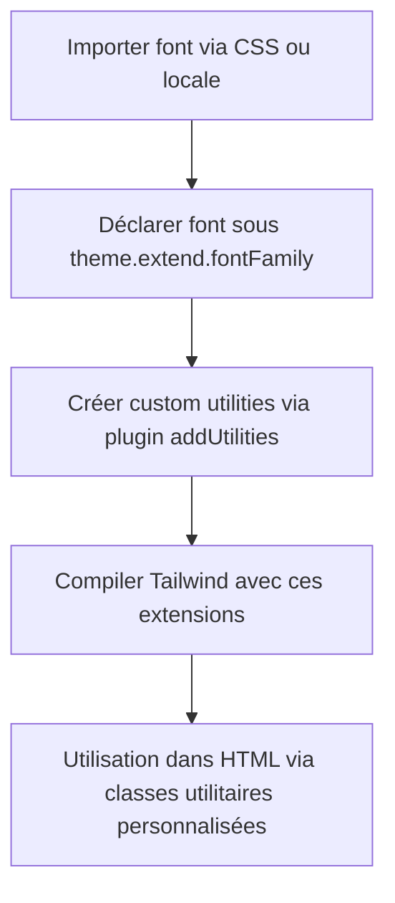

# 03-02-02 - Ajout de fonts et custom utilities dans Tailwind CSS

## Introduction

Tailwind CSS offre une base solide de classes utilitaires, mais personnaliser l’apparence de votre projet passe souvent par l’ajout de polices personnalisées et de nouvelles utilités spécifiques. Ce processus améliore l’identité visuelle et le confort du développement en unifiant styles standards et personnalisés. Cet article détaille comment intégrer des fonts custom et créer des utilitaires Tailwind sur-mesure via la configuration.

---

## 1. Ajouter des fonts personnalisées dans Tailwind CSS

### Étape 1 : importer la police

Les polices peuvent être importées via CDN (ex : Google Fonts) ou ajoutées localement.

**Exemple avec Google Fonts dans un fichier CSS global (`index.css`):**

```css
@import url('https://fonts.googleapis.com/css2?family=Roboto:wght@400;700&display=swap');
```

### Étape 2 : déclarer la font dans la configuration Tailwind

Dans `tailwind.config.js` :

```js
module.exports = {
  theme: {
    extend: {
      fontFamily: {
        roboto: ['Roboto', 'sans-serif'],
      },
    },
  },
}
```

### Étape 3 : utiliser la font dans vos classes utilitaires

```html
<h1 class="font-roboto text-lg font-bold">
  Titre avec font Roboto
</h1>
```

---

## 2. Création de custom utilities (utilitaires personnalisés)

Parfois, des styles ne sont pas couverts par Tailwind par défaut. On peut créer des utilitaires personnalisées avec le plugin `addUtilities`.

### Exemple d’un utilitaire pour une ombre de texte :

Dans `tailwind.config.js`, ajoutez :

```js
const plugin = require('tailwindcss/plugin')

module.exports = {
  theme: {
    extend: {},
  },
  plugins: [
    plugin(function({ addUtilities }) {
      const newUtilities = {
        '.text-shadow': {
          textShadow: '2px 2px 4px rgba(0,0,0,0.1)',
        },
        '.text-shadow-md': {
          textShadow: '3px 3px 6px rgba(0,0,0,0.15)',
        },
      }
      addUtilities(newUtilities, ['responsive', 'hover'])
    }),
  ],
}
```

**Utilisation :**

```html
<p class="text-shadow-md hover:text-shadow">
  Texte avec ombre personnalisée
</p>
```

---

## 3. Définir des variantes pour custom utilities

Dans l’exemple ci-dessus, `addUtilities` est appelé avec `['responsive', 'hover']` pour activer ces variantes, ce qui rend les classes utilisables avec les préfixes responsives (ex : `md:text-shadow`) et les pseudo-classes (`hover:text-shadow`).

---

## 4. Exemple complet combiné fonts et utilities

```js
const plugin = require('tailwindcss/plugin')

module.exports = {
  theme: {
    extend: {
      fontFamily: {
        roboto: ['Roboto', 'sans-serif'],
      },
    },
  },
  plugins: [
    plugin(({ addUtilities }) => {
      const utilities = {
        '.text-shadow': {
          textShadow: '2px 2px 4px rgba(0,0,0,0.1)',
        },
      }
      addUtilities(utilities, ['responsive', 'hover'])
    }),
  ],
}
```

---

## 5. Diagramme Mermaid : Configuration d’ajout de fonts et utilities



---

## 6. Points complémentaires utiles

- Les fonts locales peuvent être chargées via `@font-face` dans un CSS importé.  
- Pour de multiples polices, ajoutez-les dans `fontFamily` sous différents noms.  
- Utilisez les plugins Tailwind officiels ou tiers si disponibles avant de créer vos propres utilities.  
- Les utilitaires personnalisés suivent la même logique que les utilitaires de Tailwind (elles peuvent être responsives, hover, focus, etc.).  
- Toujours tester les performances et la cohérence sur différents écrans et navigateurs.

---

## 7. Sources et références

- [Tailwind CSS Documentation - Extending the default theme](https://tailwindcss.com/docs/theme#extending-the-default-theme)  
- [Tailwind CSS Documentation - Plugins](https://tailwindcss.com/docs/plugins)  
- [Google Fonts](https://fonts.google.com/)  
- [Creating Custom Utilities in Tailwind](https://tailwindcss.com/docs/plugins#adding-utilities)  
- [CSS-Tricks - Extending Tailwind](https://css-tricks.com/creating-custom-tailwind-css-utilities-with-plugins/)

---

## Conclusion

Ajouter des polices personnalisées et créer des utilitaires sur-mesure dans Tailwind CSS offre un contrôle accru sur le design tout en conservant la rapidité et la clarté du développement grâce aux classes utilitaires. Cette approche hybride maximise flexibilité et productivité, essentielle dans la plupart des projets modernes.