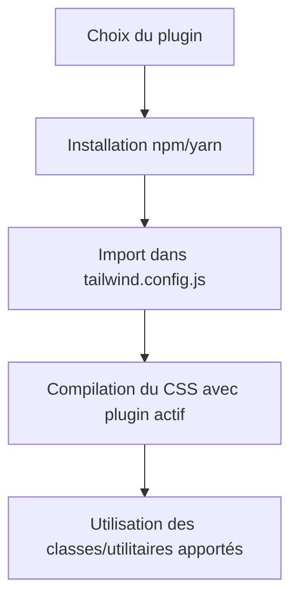

# 03-03-01 - Présentation et installation des plugins courants dans Tailwind CSS

## Introduction

Tailwind CSS est conçu pour être modulable. Les **plugins** étendent ses fonctionnalités de base en ajoutant des utilitaires, composants ou variantes spécifiques. Cette approche enrichit l’écosystème Tailwind tout en restant légère. Cet article présente les plugins les plus couramment utilisés, leur rôle, et la manière de les installer et configurer rapidement.

---

## 1. Qu’est-ce qu’un plugin Tailwind CSS ?

Un plugin est une extension JavaScript qui ajoute ou modifie :

- Des utilitaires CSS (nouvelles classes)  
- Des composants réutilisables  
- Des variantes (ex : hover, focus, dark)  
- Ou d’autres comportements liés au style

Les plugins officiels sont maintenus par l’équipe Tailwind, d’autres sont fournis par la communauté.

---

## 2. Plugins officiels populaires et utilité

| Plugin                      | Fonctionnalités principales                                          |
|----------------------------|--------------------------------------------------------------------|
| @tailwindcss/forms          | Styles de base optimisés pour les formulaires                      |
| @tailwindcss/typography     | Gestion avancée de la typographie (prose)                          |
| @tailwindcss/aspect-ratio   | Gestion facile des ratios d’aspect d’éléments (comme vidéos)       |
| @tailwindcss/line-clamp     | Limitation du nombre de lignes dans un bloc de texte               |
| @tailwindcss/container-queries | Support des container queries (bientôt standard CSS)           |

---

## 3. Installation d’un plugin officiel

### Exemple avec `@tailwindcss/forms`

1. Installer via npm ou yarn

```bash
npm install @tailwindcss/forms
# ou
yarn add @tailwindcss/forms
```

2. Ajouter dans la configuration `tailwind.config.js`

```js
module.exports = {
  // ...
  plugins: [
    require('@tailwindcss/forms'),
  ],
}
```

---

## 4. Exemple d’utilisation : plugin forms

Ce plugin remet à plat le style par défaut des formulaires pour obtenir un rendu plus uniforme et esthétique.

```html
<form class="space-y-4">
  <input type="text" placeholder="Nom" class="form-input" />
  <select class="form-select">
    <option>Option 1</option>
  </select>
  <button class="btn btn-primary">Envoyer</button>
</form>
```

Ici, `form-input` et `form-select` tirent parti des styles générés par le plugin.

---

## 5. Ajouter un plugin personnalisé

Tailwind permet aussi la création de plugins personnalisés. Exemple simple :

```js
const plugin = require('tailwindcss/plugin')

module.exports = {
  plugins: [
    plugin(function({ addUtilities }) {
      const newUtils = {
        '.text-glow': {
          textShadow: '0 0 8px rgba(255, 255, 255, 0.7)',
        },
      }
      addUtilities(newUtils, ['responsive', 'hover'])
    }),
  ],
}
```

Vous pouvez maintenant utiliser `text-glow`, avec variantes responsive et hover.

---

## 6. Installation parallèle de plusieurs plugins

Il est possible d’installer et configurer plusieurs plugins en même temps :

```js
module.exports = {
  plugins: [
    require('@tailwindcss/forms'),
    require('@tailwindcss/typography'),
    require('@tailwindcss/aspect-ratio'),
  ],
}
```

---

## 7. Diagramme Mermaid : cycle d’ajout d’un plugin Tailwind



---

## 8. Sources et références

- [Tailwind CSS Documentation - Plugins](https://tailwindcss.com/docs/plugins)  
- [Tailwind CSS - Official Plugins GitHub](https://github.com/tailwindlabs/tailwindcss-forms)  
- [Tailwind CSS Typography Plugin](https://github.com/tailwindlabs/tailwindcss-typography)  
- [Tailwind CSS Aspect Ratio Plugin](https://github.com/tailwindlabs/tailwindcss-aspect-ratio)  
- [Building Plugins - Tailwind CSS](https://tailwindcss.com/docs/plugins#creating-plugins)  
- [CSS-Tricks - Tailwind CSS Plugins Overview](https://css-tricks.com/how-to-use-tailwind-css-plugins/)

---

## Conclusion

Les plugins dans Tailwind CSS permettent d’enrichir considérablement votre boîte à outils avec des fonctionnalités ciblées, tout en respectant la philosophie utility-first. Utiliser les plugins officiels facilite la gestion de cas courants comme les formulaires ou la typographie, tandis que la création de plugins sur-mesure offre une flexibilité maximale adaptée à chaque projet.