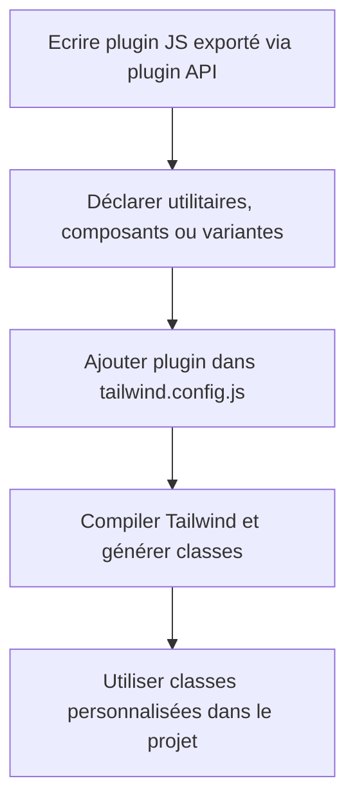

# 03-03-02 - Création de plugins personnalisés dans Tailwind CSS

## Introduction

La force de Tailwind CSS réside non seulement dans ses classes utilitaires prédéfinies, mais aussi dans la possibilité d’étendre ses fonctionnalités via des **plugins personnalisés**. Ces plugins permettent d’ajouter des utilitaires, composants ou variantes spécifiques répondant aux besoins propres à chaque projet. Cet article explique comment créer, configurer et utiliser vos propres plugins Tailwind.

---

## 1. Pourquoi créer un plugin personnalisé ?

- Ajouter des utilitaires CSS sur mesure non proposées par Tailwind  
- Réutiliser des styles complexes en classe unique  
- Introduire des variantes personnalisées (ex : état, responsive)  
- Centraliser la gestion de styles spécifiques au projet

---

## 2. Structure d’un plugin Tailwind

Un plugin est une fonction JavaScript qui reçoit un objet utilitaire (`pluginAPI`) permettant d’ajouter des utilitaires, composants, variantes.

### Exemple basique

```js
const plugin = require('tailwindcss/plugin')

const myPlugin = plugin(function({ addUtilities }) {
  const newUtilities = {
    '.text-glow': {
      textShadow: '0 0 5px rgba(255, 255, 255, 0.8)',
    },
  }
  addUtilities(newUtilities, ['responsive', 'hover'])
})

module.exports = {
  plugins: [myPlugin],
}
```

Ici, la classe `.text-glow` est ajoutée avec variantes responsive et hover.

---

## 3. Ajouter des utilitaires personnalisés

La méthode `addUtilities` permet d’introduire de nouvelles classes CSS utilitaires.

- **Paramètres** :
  - Objet JS représentant les classes et leurs règles CSS  
  - Tableau de variantes applicables (`['responsive', 'hover', 'focus']`, etc.)

### Exemple d’utilitaire pour arrondir au quart

```js
plugin(function({ addUtilities }) {
  addUtilities({
    '.rounded-1/4': {
      borderRadius: '4px',
    },
    '.rounded-1/2': {
      borderRadius: '8px',
    },
  })
})
```

---

## 4. Ajouter des composants via `addComponents`

Permet de créer des classes plus complexes, souvent regroupant plusieurs propriétés CSS comme des boutons personnalisés.

### Exemple

```js
plugin(function({ addComponents }) {
  addComponents({
    '.btn-custom': {
      padding: '.5rem 1rem',
      borderRadius: '.25rem',
      fontWeight: '600',
      backgroundColor: '#4f46e5',
      color: 'white',
      '&:hover': {
        backgroundColor: '#4338ca',
      },
    },
  })
})
```

---

## 5. Ajouter des variantes via `addVariant`

On peut créer des variantes personnalisées pour cibler certains états.

### Exemple d’une variante `important`

```js
plugin(function({ addVariant }) {
  addVariant('important', ({ modifySelectors, separator }) => {
    modifySelectors(({ className }) => {
      return `.\\!${className} !important`
    })
  })
})
```

Cette variante permet d’utiliser une classe avec `important:` pour forcer la priorité CSS.

---

## 6. Diagramme Mermaid : cycle de création d’un plugin personnalisé



---

## 7. Intégration dans la configuration Tailwind

Dans `tailwind.config.js` :

```js
const plugin = require('tailwindcss/plugin')

module.exports = {
  plugins: [
    plugin(function({ addUtilities }) {
      addUtilities({
        '.text-glow': {
          textShadow: '0 0 5px rgba(255, 255, 255, 0.7)',
        },
      }, ['responsive', 'hover'])
    }),
  ],
}
```

---

## 8. Bonnes pratiques

- Limitez les plugins à des fonctionnalités vraiment récurrentes dans votre projet  
- Documentez les classes ajoutées pour faciliter leur usage et maintenance  
- Combinez avec les variantes Tailwind pour maximiser la flexibilité  
- Testez toujours en environnement production pour vérifier la génération CSS

---

## 9. Sources et références

- [Tailwind CSS - Plugin API](https://tailwindcss.com/docs/plugins)  
- [Créer un Plugin Tailwind CSS (Article CSS-Tricks)](https://css-tricks.com/creating-custom-tailwind-css-utilities-with-plugins/)  
- [Tailwind Labs GitHub - Exemples de plugins](https://github.com/tailwindlabs/tailwindcss-plugins)  
- [Personnaliser Tailwind CSS avec les plugins (Smashing Magazine)](https://www.smashingmagazine.com/2021/02/tailwindcss-theming/)  

---

## Conclusion

La création de plugins personnalisés dans Tailwind CSS offre une forte extensibilité et un contrôle fin sur la génération des classes utilitaires, composants et variantes. Cette technique optimise la réutilisabilité du code et simplifie la gestion des styles spécifiques à votre projet tout en s’insérant de manière fluide dans l’écosystème Tailwind.