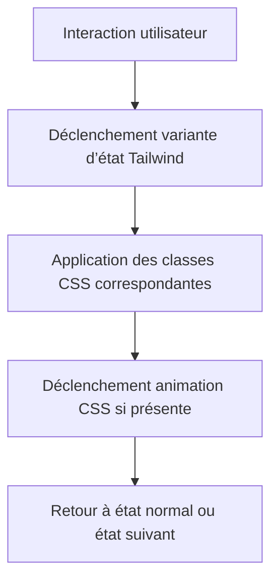

# 03-04-03 - Gestion des états et animations avec Tailwind CSS

## Introduction

Tailwind CSS propose un système complet pour gérer les **états interactifs** (hover, focus, active, disabled, etc.) et intégrer des **animations** CSS en toute simplicité. Cet article présente comment tirer parti des variantes d’états et des utilities d’animation de Tailwind, pour rendre une interface dynamique et réactive.

---

## 1. Gestion des états dans Tailwind

Les états sont utilisés pour appliquer des styles lorsque l’utilisateur interagit (survole, clique, navigue au clavier).

### Variants d’état disponibles

- `hover:` — au survol  
- `focus:` — lorsque l’élément est au focus (ex: tab clavier)  
- `active:` — pendant le clic / activation  
- `disabled:` — quand un élément est désactivé  
- `visited:` — pour les liens visités  
- `focus-visible:` — focus visible selon navigateur  

### Exemple de gestion d’états

```html
<button class="bg-blue-500 text-white px-4 py-2 rounded
               hover:bg-blue-600 focus:outline-none focus:ring-4 focus:ring-blue-300
               active:bg-blue-700 disabled:bg-gray-400 disabled:cursor-not-allowed">
  Bouton interactif
</button>
```

- Au survol, fond devient plus sombre  
- Au focus clavier, anneau autour du bouton  
- À l’activation clic, fond encore plus sombre  
- En disabled, apparence grisée et curseur bloqué  

---

## 2. Animation native avec Tailwind

### Classes d’animation de base

Tailwind offre plusieurs classes utilitaires pour gérer animations simple :

| Classe            | Description                    |
|-------------------|--------------------------------|
| `animate-spin`    | Rotation infinie (spinner)    |
| `animate-ping`    | Pulse rapide                  |
| `animate-pulse`   | Pulse lent                   |
| `animate-bounce`  | Effet rebond                 |

### Exemple

```html
<div class="w-10 h-10 bg-green-500 rounded-full animate-bounce"></div>
```

Ce cercle vert va rebondir en continu.

---

## 3. Créer des animations personnalisées

Le fichier `tailwind.config.js` permet de définir ses propres animations et keyframes.

### Exemple : créer une animation `wiggle`

```js
module.exports = {
  theme: {
    extend: {
      animation: {
        wiggle: 'wiggle 1s ease-in-out infinite',
      },
      keyframes: {
        wiggle: {
          '0%, 100%': { transform: 'rotate(-3deg)' },
          '50%': { transform: 'rotate(3deg)' },
        },
      },
    },
  },
}
```

Puis appliquer sur un élément :

```html
<div class="animate-wiggle">Je bouge</div>
```

---

## 4. Combiner états et animations

Les états Tailwind peuvent être combinés avec des animations pour des effets UX riches.

### Exemple : animéer un bouton au hover

```html
<button class="bg-indigo-500 text-white px-6 py-3 rounded 
               hover:animate-pulse">
  En savoir plus
</button>
```

Au survol, le bouton pulse grâce à l’animation.

---

## 5. Diagramme Mermaid : cycle gestion des états et animations



---

## 6. Bonnes pratiques

- Utiliser les animations avec modération pour ne pas gêner la lecture  
- Favoriser les animations natives CSS ultra-performantes  
- Associer une transition (`transition`, `duration-xxx`) pour un effet fluide  
- Tester le rendu des états sur tous navigateurs supportés

---

## 7. Sources et références

- [Tailwind CSS - Hover, Focus and Other States](https://tailwindcss.com/docs/hover-focus-and-other-states)  
- [Tailwind CSS - Animation](https://tailwindcss.com/docs/animation)  
- [MDN Web Docs - CSS Animations](https://developer.mozilla.org/en-US/docs/Web/CSS/CSS_Animations)  
- [CSS-Tricks - Animations with Tailwind](https://css-tricks.com/introduction-to-tailwind-animations/)  

---

## Conclusion

L'intégration simple des variantes d’état et des animations dans Tailwind CSS permet de créer des interfaces interactives, réactives et agréables à utiliser. En combinant judicieusement les utilities d’états avec les animations natives ou personnalisées, il est possible d’améliorer clairement l’expérience utilisateur tout en garantissant des performances optimales.