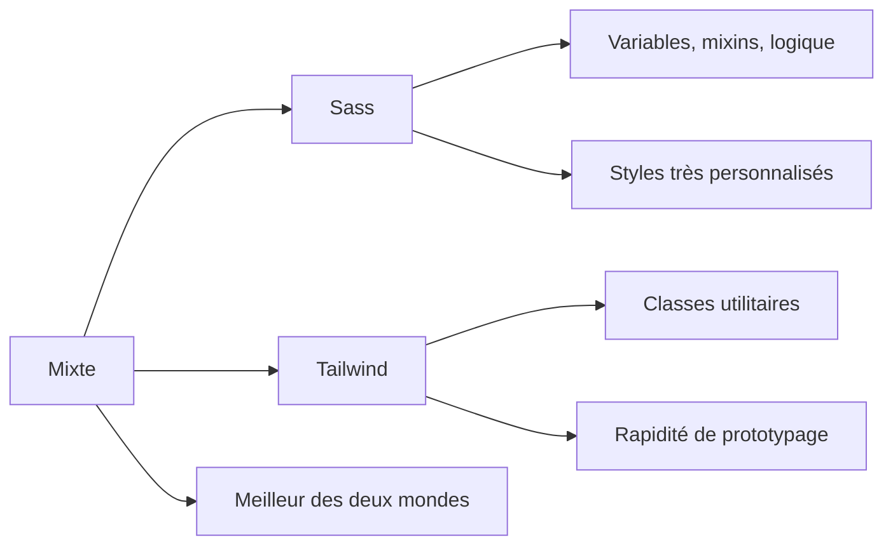

# 04-01-01 - Choix de la méthodologie CSS : Sass, Tailwind ou mixte

## Introduction

Lors du lancement d’un projet front-end, le choix de la méthodologie CSS impacte directement la maintenabilité, la performance et la productivité. Trois approches courantes s’imposent aujourd’hui : **Sass**, **Tailwind CSS**, ou une approche mixte combinant les deux. Cet article compare ces méthodologies, détaille leurs avantages et limites, et illustre comment les choisir en fonction des besoins.

---

## 1. Sass : un préprocesseur CSS puissant

### Qu’est-ce que Sass ?

Sass (Syntactically Awesome Stylesheets) est un langage de préprocesseur CSS permettant d’utiliser variables, mixins, fonctions, héritage, et logique dans vos feuilles de styles classiques.

### Avantages

- Syntaxe étendue et expressive  
- Gestion avancée des variables, boucles, conditions  
- Facilite la réutilisation et structuration du CSS  
- Compatible avec tous les frameworks CSS et projets existants  

### Exemple simple avec Sass

```scss
$primary-color: #3490dc;

.button {
  background-color: $primary-color;
  padding: 10px 20px;
  border-radius: 5px;

  &:hover {
    background-color: darken($primary-color, 10%);
  }
}
```

---

## 2. Tailwind CSS : framework utilitaire-first

### Qu’est-ce que Tailwind ?

Tailwind est un framework CSS utilitaire, proposant des classes basiques très granulaires (`p-4`, `bg-red-500`, etc.) permettant de construire des interfaces sans écrire de CSS.

### Avantages

- Rapidité de prototypage grâce aux classes prêtes à l’emploi  
- Cohérence visuelle grâce au design system intégré  
- Haute personnalisation via configuration (tailwind.config.js)  
- Réduction du CSS inutilisé grâce à purge et compilation à la demande  

### Exemple avec Tailwind

```html
<button class="bg-blue-500 hover:bg-blue-700 text-white font-bold py-2 px-4 rounded">
  Bouton Tailwind
</button>
```

---

## 3. Approche mixte : Sass + Tailwind

### Pourquoi combiner ?

- Gérer la structure globale et styles complexes via Sass  
- Utiliser Tailwind pour accélérer le développement de l’UI standardisée  
- Profiter des variables et fonctions Sass pour gérer des styles personnalisés  
- Éviter la surcharge inutilisée de Tailwind grâce à une architecture modulaire  

### Exemple

```scss
@import "tailwindcss/base";
@import "tailwindcss/components";
@import "tailwindcss/utilities";

$btn-radius: 12px;

.custom-button {
  @apply bg-green-500 text-white font-semibold py-2 px-6;
  border-radius: $btn-radius;

  &:hover {
    @apply bg-green-700;
  }
}
```

On profite d’`@apply` pour réutiliser les classes Tailwind dans Sass.

---

## 4. Critères de choix

| Critère                     | Sass                         | Tailwind CSS               | Mixte                        |
|-----------------------------|------------------------------|----------------------------|------------------------------|
| Taille du projet             | Moyenne à grande              | Petits à moyens projets     | Projets de toutes tailles    |
| Complexité des styles        | Très nombreux ou sur-mesure  | UI standard et rapide       | Gestion fine + rapidité      |
| Courbe d’apprentissage      | Plus haute                   | Relativement basse          | Moyenne                      |
| Performance CSS             | Contrôle total, optimisation manuelle | Purge automatique, CSS minimal | Meilleur compromis           |
| Collaboration               | Classique, styles sémantiques| Classes utilitaires, normes strictes | Mixte, nécessite règles claires |

---

## 5. Diagramme Mermaid : comparaison méthodologique



---

## 6. Conclusion

- **Sass** reste idéal pour des projets avec une architecture CSS complexe et des besoins très spécifiques.  
- **Tailwind CSS** accélère fortement le développement UI grâce à une approche utilitaire, parfait pour itérations rapides et prototypage.  
- **L’approche mixte** combine la puissance des deux, en tirant parti des avantages du système de design Tailwind, tout en conservant la flexibilité et la structure offerte par Sass.

---

## 7. Sources et références

- [Sass Official Documentation](https://sass-lang.com/documentation)  
- [Tailwind CSS Official Site](https://tailwindcss.com/)  
- [CSS-Tricks - Sass vs Tailwind](https://css-tricks.com/sass-vs-tailwind-css-the-right-tool-for-the-job/)  
- [Smashing Magazine - Combining Sass and Tailwind](https://www.smashingmagazine.com/2021/04/tailwind-sass-workflow/)  

---

Adopter la bonne méthodologie CSS selon votre contexte permet d'améliorer la qualité et la maintenabilité de votre projet, tout en gagnant en efficacité dans la phase de développement.