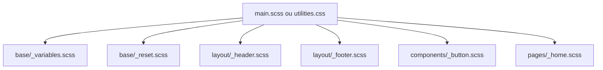

# 04-01-02 - Architecture du projet et organisation des fichiers CSS

## Introduction

La manière dont vous structurez votre projet CSS conditionne la lisibilité, la maintenabilité et la scalabilité du code. Une architecture bien pensée facilite le travail collaboratif et la gestion des styles au fur et à mesure de l’évolution du projet. Cet article présente les bonnes pratiques pour organiser les fichiers CSS/Sass, que vous utilisiez une méthodologie traditionnelle, Tailwind CSS ou une combinaison des deux.

---

## 1. Principes fondamentaux d’organisation CSS

- **Modularité** : diviser les styles en petits fichiers cohérents (composants, layout, thèmes...)  
- **Réutilisabilité** : envisager des styles « atomiques » ou basés sur des composants réutilisables  
- **Lisibilité** : nommage clair des fichiers et hiérarchie logique  
- **Évolutivité** : architecture adaptée à la croissance du projet

---

## 2. Organisation typique avec Sass

Une organisation classique en méthode **ITCSS** (Invert Triangle CSS) ou **SMACSS** est conseillée. Exemple minimaliste :

```
/styles
│
├─ base/
│   ├─ _reset.scss       // Reset CSS
│   ├─ _typography.scss  // Styles typographiques généraux
│   └─ _variables.scss   // Variables globales (couleurs, tailles...)
│
├─ components/
│   ├─ _button.scss
│   ├─ _card.scss
│   └─ _modal.scss
│
├─ layout/
│   ├─ _header.scss
│   ├─ _footer.scss
│   └─ _grid.scss
│
├─ pages/
│   └─ _home.scss
│
└─ main.scss             // Fichier principal, importe tous les partials
```

---

## 3. Exemple de fichier `main.scss`

```scss
@import 'base/variables';
@import 'base/reset';
@import 'base/typography';

@import 'layout/header';
@import 'layout/footer';
@import 'layout/grid';

@import 'components/button';
@import 'components/card';
@import 'components/modal';

@import 'pages/home';
```

Ce découpage permet d’isoler les responsabilités et de s’y retrouver facilement.

---

## 4. Organisation dans un projet Tailwind CSS

Avec Tailwind, le CSS « utilitaire » est dans un fichier unique généré, mais vous pouvez structurer vos styles personnalisés ainsi :

```
/styles
│
├─ utilities.css         // importations Tailwind + custom utilities
├─ components/
│   ├─ buttons.css       // styles buttons spécifiques avec @apply
│   └─ cards.css
├─ base.css              // styles globaux (typographie, reset)
└─ tailwind.config.js    // configuration Tailwind
```

### Exemple d’utilisation `@apply`

```css
/* buttons.css */
.btn-primary {
  @apply bg-blue-600 text-white font-semibold py-2 px-4 rounded;
  &:hover {
    @apply bg-blue-700;
  }
}
```

---

## 5. Architecture mixte Sass + Tailwind

Combiner les deux via un point d’entrée Sass :

```scss
@import "tailwindcss/base";
@import "tailwindcss/components";
@import "tailwindcss/utilities";

@import "custom/variables";
@import "custom/components/buttons";
@import "custom/layout/header";
```

Cela convient pour gérer des styles globaux avec Sass et pouvoir utiliser Tailwind en utilitaire.

---

## 6. Diagramme Mermaid : organisation idéale des fichiers CSS



---

## 7. Bonnes pratiques supplémentaires

- **Nommer les fichiers avec un préfixe `_` pour partials (Sass)**  
- Organiser par fonctionnalités (base, layout, composants, pages)  
- Versionner les fichiers avec Git à chaque évolution majeure  
- Utiliser l’automatisation (ex : webpack, vite) pour importer, compiler et minifier  
- Documenter l’architecture dans le README du projet

---

## 8. Sources et références

- [ITCSS - Inverted Triangle CSS Architecture](https://itcss.io/)  
- [Sass Guidelines](https://sass-guidelin.es/)  
- [Tailwind CSS - Installation](https://tailwindcss.com/docs/installation)  
- [CSS-Tricks - Sass File Structure](https://css-tricks.com/sass-partials-and-partial-imports/)  
- [Smashing Magazine - Organizing Tailwind Projects](https://www.smashingmagazine.com/2021/10/organizing-tailwind-projects/)  

---

## Conclusion

Une architecture CSS claire et modulaire facilite la maintenabilité et la scalabilité des projets web. Que vous utilisiez Sass, Tailwind ou les deux, une organisation cohérente en fichiers et dossiers, associée à des outils d’automatisation, optimise le flux de travail et la qualité du code.