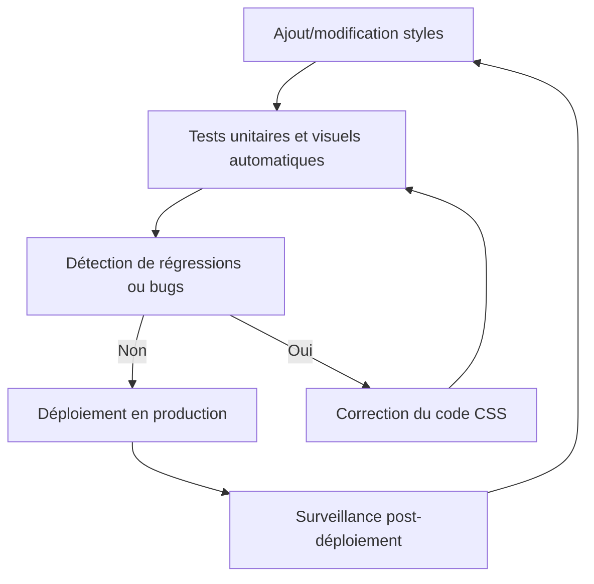

# 04-02-03 - Tests et maintenance des interfaces CSS modernes

## Introduction

Assurer la qualité et la pérennité d’une interface construite avec CSS nécessite une approche rigoureuse de **tests** et de **maintenance**. Cet article présente les bonnes pratiques, outils et stratégies adaptées aux projets modernes utilisant Sass, Tailwind ou méthodologies mixtes. 

---

## 1. Pourquoi tester le CSS ?

- **Détecter les régressions** visuelles lors des évolutions  
- **Garantir la conformité UX/accessibilité**  
- **Maintenir une base saine malgré la croissance** du code  
- **Optimiser les performances et la maintenabilité**

---

## 2. Types de tests CSS

- **Tests visuels (Visual Regression Testing)**  
  Capturer l’apparence des composants UI et détecter toute modification inattendue.  

- **Tests unitaires CSS**  
  Vérifier que certains styles sont bien appliqués via des tests automatisés (ex: Jest avec jest-dom).

- **Tests fonctionnels end-to-end (E2E)**  
  Vérifier le comportement complet (interaction + style) avec Cypress, Playwright.  

---

## 3. Outils pour tests CSS modernes

| Outil                | Fonctionnalité principale            | URL                          |
|----------------------|------------------------------------|------------------------------|
| Percy                | Tests de régression visuelle        | https://percy.io             |
| Chromatic             | Tests visuels pour Storybook        | https://www.chromatic.com    |
| BackstopJS            | Capture des screenshots et diff     | https://github.com/garris/BackstopJS |
| Jest + jest-dom       | Tests unitaires dans React          | https://jestjs.io            |
| Cypress               | Tests E2E avec assertions CSS       | https://www.cypress.io       |

---

## 4. Exemple simple de test visuel avec BackstopJS

1. Installation et configuration de `backstop.json` :

```json
{
  "id": "mon-projet",
  "viewports": [
    { "label": "desktop", "width": 1024, "height": 768 }
  ],
  "scenarios": [
    {
      "label": "Bouton primaire",
      "url": "http://localhost:3000",
      "selectors": [".btn-primary"],
      "delay": 1000
    }
  ]
}
```

2. Commandes :

```bash
backstop test    # compare screenshots avec références
backstop approve # valide nouvelles références visuelles
```

---

## 5. Maintenance CSS : bonnes pratiques

- **Utiliser une architecture modulaire** (ex: ITCSS, BEM, SMACSS) pour limiter l’effet papillon  
- **Limiter la profondeur de spécificité CSS** (éviter les sélecteurs trop complexes)  
- **Documenter les composants et variables** (style guides, storybook)  
- **Automatiser la compilation, minification, purge CSS** (ex: PurgeCSS avec Tailwind)  
- **Revue de code CSS** lors des pull requests pour détecter les conflits ou styles inutiles

---

## 6. Exemples avec Tailwind et purge CSS

Via `tailwind.config.js` pour éliminer le CSS inutilisé :

```js
module.exports = {
  purge: ['./src/**/*.{js,jsx,ts,tsx,html}'],
  // autres configurations
};
```

Cela réduit la taille du CSS final, facilitant la maintenance.

---

## 7. Diagramme Mermaid : cycle tests et maintenance CSS



---

## 8. Conclusion

Intégrer des tests automatiques et adopter une organisation claire sont clés pour garantir la qualité et la durabilité des interfaces CSS modernes. Les outils de tests visuels et unitaires combinés à une maintenance rigoureuse permettent d’éviter les erreurs coûteuses et d’assurer une expérience utilisateur optimisée.

---

## 9. Sources et références

- [Percy - Visual Testing](https://percy.io/)  
- [Chromatic Documentation](https://www.chromatic.com/docs)  
- [BackstopJS GitHub](https://github.com/garris/BackstopJS)  
- [Jest Documentation](https://jestjs.io/fr/docs/using-matchers)  
- [Cypress Testing](https://docs.cypress.io/guides/overview/why-cypress)  
- [Tailwind CSS Purge Documentation](https://tailwindcss.com/docs/optimizing-for-production)  
- [CSS-Tricks - CSS Testing Strategies](https://css-tricks.com/testing-css/)  

