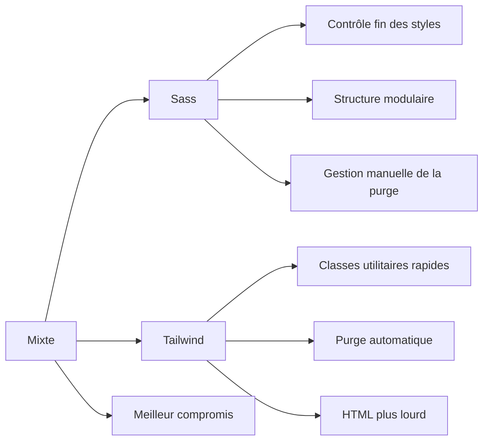

# 04-03-01 - Points forts et limites de Sass et Tailwind CSS

## Introduction

Sass et Tailwind CSS sont deux approches CSS modernes très prisées dans le développement front-end. Elles répondent à des besoins différents et présentent chacunes leurs avantages et limites. Cet article compare ces méthodes pour vous aider à choisir ou combiner judicieusement l’une ou l’autre dans vos projets.

---

## 1. Sass : une extension puissante du CSS classique

### Points forts

- **Syntaxe enrichie** : variables, boucles, conditions, fonctions, mixins...  
- **Organisation modulaire** : partials, importations faciles  
- **Grande flexibilité** : permet de créer une architecture CSS personnalisée (ex : BEM, ITCSS)  
- **Interopérabilité** : fonctionne avec tous frameworks CSS et JavaScript  
- **Support mature et communauté large**

### Limites

- **Courbe d’apprentissage** plus élevée que CSS natif/Tailwind  
- **Maintenance** peut devenir difficile avec de grands projets sans organisation stricte  
- **Pas d’optimisation automatique** : nécessité de gérer la purge des règles inutilisées  
- **Possibilité d’accumulation de code CSS redondant** sans discipline

### Exemple Sass

```scss
$primary-color: #1d4ed8;

.button {
  background-color: $primary-color;
  padding: 0.5rem 1rem;
  border-radius: 0.375rem;
  color: white;

  &:hover {
    background-color: darken($primary-color, 10%);
  }
}
```

---

## 2. Tailwind CSS : framework utilitaire-first

### Points forts

- **Rapid prototyping** : classes utilitaires prêtes à l’emploi  
- **Consistance et design system intégré** via configuration centralisée (`tailwind.config.js`)  
- **Optimisation automatique** : purge CSS intégrée  
- **Réactivité native** : classes pour media queries (`sm:`, `md:`, etc.)  
- **Facilité d’adoption** par des développeurs non spécialisés en CSS pur

### Limites

- **HTML plus verbeux** du fait des nombreuses classes utilitaires  
- **Peut sembler moins intuitif** pour les styles très spécifiques ou sur-mesure  
- **Personnalisation avancée parfois complexe** (nécessite souvent ajustements de config)  
- **Risque de styles inline difficiles à maintenir en large codebase** sans conventions strictes

### Exemple Tailwind

```html
<button class="bg-blue-600 hover:bg-blue-700 text-white py-2 px-4 rounded">
  Bouton Tailwind
</button>
```

---

## 3. Tableau comparatif résumé

| Critère              | Sass                         | Tailwind CSS                |
|----------------------|------------------------------|-----------------------------|
| Facilité de prise en main | Modérée à élevée            | Rapide, classes descriptives |
| Contrôle du style    | Très élevé, entièrement personnalisable | Via configuration / classes utilitaires |
| Organisation         | Modulaire, partagée          | Utilitaires + composant via `@apply`  |
| Performance         | Dépend du build + purge CSS  | Purge CSS robuste intégrée   |
| Taille de code HTML | Minimal                      | Peut être plus verbeux       |
| Extensibilité        | Très bonne                  | Bonne mais config requise    |

---

## 4. Utilisation mixte : Sass + Tailwind

Combiner les deux permet de profiter de la puissance de Sass (logique, fonctions, gestion avancée de styles complexes) et de la productivité de Tailwind pour l’UI standardisée.

### Exemple mixte avec `@apply`

```scss
@import "tailwindcss/base";
@import "tailwindcss/components";
@import "tailwindcss/utilities";

$btn-radius: 0.5rem;

.btn-primary {
  @apply bg-blue-600 text-white font-bold py-2 px-4 rounded;
  border-radius: $btn-radius;

  &:hover {
    @apply bg-blue-700;
  }
}
```

---

## 5. Diagramme Mermaid : comparaison Sass vs Tailwind



---

## 6. Conclusion

- **Sass est indiqué** pour des projets exigeant une personnalisation CSS pointue, une architecture claire et où le contrôle absolu des styles est nécessaire.  
- **Tailwind CSS excelle** dans les projets nécessitant rapidité, cohérence visuelle et optimisation automatique du CSS.  
- **Le mix Sass + Tailwind est pertinent** lorsque le besoin est à la fois de contrôler finement les styles tout en bénéficiant de la vitesse de développement donnée par Tailwind.

---

## 7. Sources et références

- [Sass Official Documentation](https://sass-lang.com/documentation)  
- [Tailwind CSS Official Site](https://tailwindcss.com/)  
- [CSS-Tricks - Sass vs Tailwind](https://css-tricks.com/sass-vs-tailwind-css-the-right-tool-for-the-job/)  
- [Smashing Magazine - Combining Sass and Tailwind](https://www.smashingmagazine.com/2021/04/tailwind-sass-workflow/)  
- [Dev.to - Using Tailwind and Sass together](https://dev.to/joshwcomeau/using-tailwind-and-sass-together-523i)  

---

Choisir ou combiner Sass et Tailwind CSS dépend des objectifs du projet, du profil de l’équipe et de la complexité des styles à gérer. Analyser ces points permet d’optimiser la stratégie CSS adaptée à votre contexte.