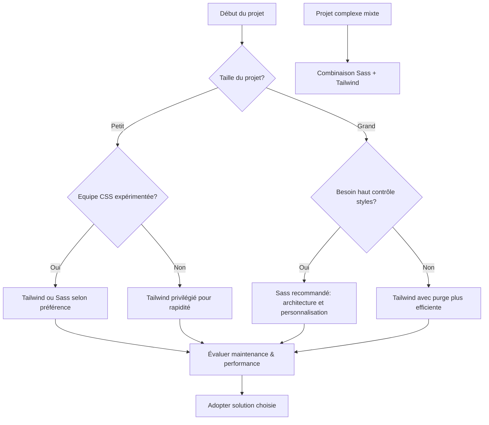

# 04-03-02 - Choix adaptés selon le contexte du projet : Sass, Tailwind ou approche mixte

## Introduction

Le choix entre Sass, Tailwind CSS ou une combinaison des deux dépend largement des besoins spécifiques, des contraintes et de l’organisation du projet. Cet article analyse les critères pour orienter ce choix de manière pragmatique, avec des exemples concrets et des recommandations basées sur les pratiques actuelles.

---

## 1. Critères clés influençant le choix

| Critère                     | Impact                              |
|-----------------------------|-----------------------------------|
| **Type et taille du projet** | Petit projet simple vs projet complexe et évolutif |
| **Équipe et compétences**   | Développeurs spécialisés en CSS vs débutants ou fullstack |
| **Vitesse de développement** | Prototypage rapide vs code maintenable long terme |
| **Design system existant**  | Intégration d’une charte précise ou besoin de flexibilité |
| **Performances et optimisation** | Besoin strict de CSS minimal |
| **Maintenance et évolutivité** | Fréquence et nature des modifications futures |

---

## 2. Quand privilégier Sass ?

- **Projets complexes et de grande envergure**, nécessitant une architecture CSS robuste (ex : applications web, dashboards)  
- **Besoin d’une personnalisation fine** des styles, interactions complexes, ou logiques conditionnelles dans le CSS  
- **Équipes familières avec le préprocesseur**, capables de structurer et maintenir un code Sass propre  
- **Intégration à des workflows CI/CD avec compilation Sass**  
- **Exemple concret** : un système de design basé sur BEM, avec variables, mixins et fonctions avancées

```scss
@mixin button-style($color) {
  background-color: $color;
  padding: 0.75rem 1.5rem;
  border-radius: 0.375rem;
}

.btn {
  @include button-style($primary-color);
  &:hover {
    @include button-style(darken($primary-color, 10%));
  }
}
```

---

## 3. Quand préférer Tailwind CSS ?

- **Petits projets, MVPs, ou prototypes nécessitant vitesse et efficacité**  
- **Projets avec besoin de cohérence visuelle forte**, utilisant les systèmes de design par défaut de Tailwind  
- **Équipes avec peu de spécialistes CSS**, ou développeurs React/Vue bénéficiant d’un style inline très proche des composants  
- **Volonté d’éviter la surcharge de styles inutilisés grâce à la purge automatique**  
- **Exemple** : page marketing avec composants repetitifs simples — boutons, cartes, mise en page responsive

```html
<div class="bg-white p-6 rounded-lg shadow-md hover:shadow-lg transition-shadow">
  <h2 class="text-xl font-semibold mb-4">Titre Card</h2>
  <p class="text-gray-600">Description simple et concise.</p>
</div>
```

---

## 4. Cas d’usage hybride (Sass + Tailwind)

- **Projets qui ont besoin de rapidité pour les styles standards et d’une personnalisation profonde sur certains modules**  
- **Utilisation de Tailwind pour layout général et composants courants, Sass pour thèmes, animations et styles métiers spécifiques**  
- **Permet d’exploiter la puissance des mixins Sass tout en bénéficiant du système utilitaire Tailwind**

```scss
@import "tailwindcss/base";
@import "tailwindcss/components";
@import "tailwindcss/utilities";

$btn-border-radius: 0.5rem;

.btn-custom {
  @apply bg-blue-600 text-white font-bold py-2 px-4;
  border-radius: $btn-border-radius;

  &:hover {
    @apply bg-blue-700;
  }
}
```

---

## 5. Diagramme Mermaid : roadmap de choix selon contexte projet



---

## 6. Autres points à considérer

- **Performance** : Tailwind minimise le CSS livré via purge, Sass nécessite une optimisation manuelle  
- **Accessibilité & sécurité** : Indépendantes de la méthode CSS mais doivent être intégrées au design et développement  
- **Documentation et collaboration** : Tailwind a avantage sur rapidité et uniformité, Sass sur expressivité et modularité  

---

## 7. Sources et références

- [Tailwind CSS - When to Use Tailwind](https://tailwindcss.com/docs/why-tailwind#when-should-i-use-tailwind)  
- [Sass-lang.com - Why Use Sass](https://sass-lang.com/guide)  
- [Smashing Magazine - Choosing CSS Architecture](https://www.smashingmagazine.com/2020/06/css-architecture-large-projects/)  
- [CSS-Tricks - Sass vs Tailwind](https://css-tricks.com/sass-vs-tailwind-css-the-right-tool-for-the-job/)  
- [Dev.to - Tailwind and Sass Together](https://dev.to/joshwcomeau/using-tailwind-and-sass-together-523i)  

---

## Conclusion

Le contexte du projet guide naturellement l’outil ou la méthode CSS à adopter. Sass reste la meilleure option pour les projets complexes avec des exigences fortes de personnalisation tandis que Tailwind accélère le développement sur des interfaces standardisées. Combiner les deux offre un très bon compromis dans de nombreux cas pratiques, en conservant la puissance et la flexibilité nécessaires.