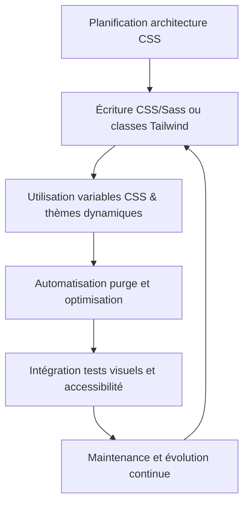

# 04-03-03 - Perspectives d'évolution et bonnes pratiques des stratégies CSS modernes

## Introduction

Les méthodes de conception CSS évoluent pour répondre à une complexité croissante des interfaces et à des exigences de performance, maintenabilité et accessibilité. Cet article expose les tendances actuelles, les bonnes pratiques consolidées, et les pistes d’évolution pour tirer le meilleur parti des technologies CSS modernes (Sass, Tailwind, CSS-in-JS, etc.).

---

## 1. Évolution des approches CSS modernes

### 1.1 De la préprocesseur au utility-first

- **Sass** a structuré et enrichi l’écriture CSS, facilitant la gestion des styles complexes via variables, mixins, fonctions, et architecture modulaire.  
- **Tailwind CSS** a apporté un virage utility-first, réduisant la dépendance aux macros et favorisant la composition rapide de styles via des classes utilitaires.  
- L’apparition des **CSS Custom Properties** permet une reprogrammation dynamique des thèmes et facilite la gestion fine du design.

### 1.2 CSS-in-JS et modularité accrue

- Intégration CSS directement dans JS via des solutions comme styled-components, Emotion, favorisant les interfaces composants encapsulés, maintenance localisée, animation simplifiée.  
- Ce modèle complète Tailwind/Sass notamment dans les applications React/Vue.

---

## 2. Bonnes pratiques pour optimiser CSS en 2024

- **Garder une architecture claire** : ITCSS, BEM, SMACSS restent des références solides pour une organisation maintenable, évitant la cascade anarchique.  
- **Automatiser la purge CSS** : Tailwind intègre PurgeCSS, mais Sass nécessite une stratégie dédiée. Minimiser la taille du fichier CSS est impératif pour performance.  
- **Favoriser le responsive design avec classes utilitaires** : Tailwind propose un système efficace, Sass facilite la gestion par media queries dynamiques.  
- **Exploiter les variables CSS natives** pour thèmes et animations, y compris variables dynamiques modifiées en JS.  
- **Test Visuel & Accessibilité** : intégrer des tests automatisés (ex: Percy, Axe) pour garantir qualité UX et éviter régressions.

---

## 3. Exemples d’application

### 3.1 Utilisation dynamique de variables CSS

```css
:root {
  --primary-color: 220 90% 56%;
  --bg-color: 0 0% 100%;
}

body {
  background-color: hsl(var(--bg-color));
  color: hsl(var(--primary-color));
  transition: background-color 0.3s, color 0.3s;
}

.dark-mode {
  --primary-color: 210 88% 65%;
  --bg-color: 210 15% 20%;
}
```

Bascule mode sombre via JS en ajoutant/supprimant la classe `.dark-mode`.

### 3.2 Combinaison Tailwind + CSS-in-JS (React example)

```jsx
import styled from 'styled-components';

const CustomButton = styled.button`
  @apply bg-blue-600 text-white py-2 px-4 rounded;
  &:hover {
    @apply bg-blue-700;
  }
`;

export default function App() {
  return <CustomButton>Cliquer</CustomButton>;
}
```

---

## 4. Diagramme Mermaid : cycle d’intégration des bonnes pratiques CSS



---

## 5. Perspectives d’évolution à surveiller

- **CSS Container Queries** : révolution dans le responsive design, adaptation en fonction de la taille du conteneur et non seulement viewport.  
- **Subgrid CSS** : amélioration des grilles imbriquées pour layouts plus complexes.  
- **Motion Design et animations natives** via API Web Animations et meilleure intégration dans les frameworks.  
- **Outils IA d’aide à la génération CSS** en émergence, facilitant le prototypage et la personnalisation rapide.  

---

## Sources et références

- [CSS-Tricks - CSS Architecture Best Practices](https://css-tricks.com/css-architecture-best-practices/)  
- [Tailwind CSS - Optimization & Purging](https://tailwindcss.com/docs/optimizing-for-production)  
- [MDN - CSS Custom Properties](https://developer.mozilla.org/en-US/docs/Web/CSS/Using_CSS_custom_properties)  
- [Smashing Magazine - Future of CSS](https://www.smashingmagazine.com/2022/01/css-future-trends/)  
- [Web.Dev - Container Queries](https://web.dev/container-query/)  
- [Styled-Components Docs](https://styled-components.com/docs)

---

## Conclusion

L'approche CSS moderne est à la croisée de plusieurs méthodes complémentaires, où Sass, Tailwind, CSS-in-JS et variables CSS impriment leurs forces. En s’appuyant sur une architecture rigoureuse, des automatisations efficaces et des tests systématiques, les équipes peuvent créer des interfaces performantes, maintenables, et évolutives tout en préparant leur code aux avancées techniques à venir.